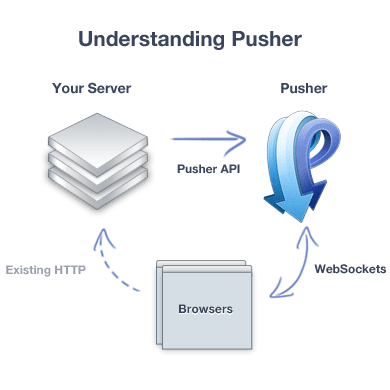
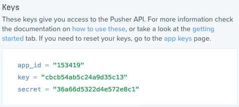

التطبيقات والتفاعلات الآنية بين الخادم والمستخدم أصبحت من الأمور التي نراها أكثر فأكثر في الويب وتطبيقات الهواتف بصفة عامة، خاصة بعد ظهور [الويب سوكتس WebSockets](http://www.tutomena.com/blog/difference-between-websockets-and-restapi/) التي تمكننا من فتح قناة (Channel) بيننا وبين الخادم لا تغلق إلا بعد انتهاء الإتصال، عكس [بروتوكول HTTP](http://www.tutomena.com/blog/difference-between-websockets-and-restapi/) الذي يقوم بغلق الإتصال بين المستخدم والخادم بعد كل طلبية Request.

العديد من الحلول بنيت على **الويب سوكتس** لتمنح المطورين بيئة وأداة جاهزة يعتمد عليها في بناء تطبيقات آنية Real-Time Applications، لعل أبرز هذه الحلول هو **واجهة Pusher** المعروفة والتي تستخدمها عدد من كبريات الشركات والمواقع العملاقة مثل نيويورك تايمز، Github، MailChimp وغيرها الكثير...

## ما هو Pusher ؟

Pusher هو واجهة API للقيام باتصالات آنية **ثنائية الإتجاه** (bi-directional) بكيفية سريعة، آمنة وسهلة بين الخادم والمستخدم بالإعتماد على بروتوكول WebSocket.

[العديد من المكتبات](https://pusher.com/docs/libraries) بلغات برمجة مختلفة تم تطويرها للتعامل مع واجهة Pusher، ولكن ما يهمنا في هذا الدرس هي المكبتة الخاصة ب PHP لنشر الأحداث (Publisher) من الخادم (Server Side Library) وكذلك سنحتاج مكتبة Pusher الخاصة بالجافاسكريبت للإستماع لهذه الأحداث (Subscriber) من واجهة المستخدم (Client Side Library).

## إظهار تنبيهات لزوار مدونتك عند نشر موضوع جديد

لكي تضح فكرة Pusher أكثر سنحاول القيام بمثال عملي وهو إظهار تنبيهات لزوار مدونتك عند نشر مواضيع جديدة، تماما كما تفعل فيسبوك مثلا عند كل تعليق جديد على إحدى منشوراتك. هذا الفكرة قد تكون فعالة فقط في المواقع والمدونات التي تستظيف عشرات الزوار على الأقل في نفس الوقت.

جدير بالذكر كذلك أنه لدينا فرصة لتجريب هذه الواجهة مجانا مع عدم إمكانية تجاوز 100 اتصال في وقت واحد، و إذا كنت ترغب في عدد اتصالات أكبر فعليك بالدفع و[اختيار العرض](https://pusher.com/pricing) الذي يناسبك.

في هذا المثال سنعمل على مدونة ووردبريس، وقبل البدء، أول ما عليك فعله هو التسجيل في [الموقع الرسمي ل Pusher](https://pusher.com) وبعد ذلك تدخل للوحدة التحكم ثم تقوم بإنشاء تطبيق جديد عن طريق الضغط على الزر **Ceate New App**.

بعد إنشاء التطبيق ستتوفر على ثلاث معلومات مهمة هي التي ستمكنك من الإتصال بواجهة Pusher وهي : app_id، key، secret.

### تنصيب مكبتة Pusher PHP

دائما أفضل استعمال **composer** لإدارة الحزم والتبعيات في PHP نظرا لسهولة استعماله وفعاليته مقارنة بتحميل واستدعاء المكتبات يدويا. لتحميل مكبتة Pusher PHP بواسطة composer نقوم بتنفيذ الأمر التالي في نافذة الأوامر CMD :

$ composer require pusher/pusher-php-server

بعد تنفيذ هذا الأمر سيقوم **composer** بتحميل المكتبة ويقوم بإنشاء مجلد جديد اسمه **_vendor_** في نفس المسار الذي نفذنا فيه الأمر، في هذه الحالة داخل مجلد القالب.

### استدعاء المكتبة

في ووردبريس هناك ما يسمى بال Hooks وهي بمثابة أحداث Events يتم انبثاقها عند كل حدث معين، وعند محاولة نشر موضوع معين في ووردبريس فإن عدة أحداث يتم انبثاقها من بينها:

- save_post
- publish_post
- auto-draft_to_publish

وفي هذه الحالة أفضل استعمال الحدث الثالث auto-draft_to_publish لأنه ينبثق فقط عند نشر موضوع جديد وليس عند تحديثه أيضا كما هو الحال في الحدثين الآخرين.

إذن سنفتح الملف **_functions.php_** داخل القالب الذي نستخدمه، ثم نقوم بإضافة الشيفرة البرمجية التالية في آخره :

function twentysixteen_new_post_published($post_id) {
require __DIR__ . '/vendor/autoload.php';

    $options = array(
    'encrypted' => true

);

$pusher = new Pusher(
	    'cbcb54ab5c24a9d35c13',
	    '36a66d5322d4e572e8c1',
	    '153419',
	    $options
);

$data = array(
  		'post_title' => get_the_title( $post_id ),
'post_url' => get_permalink( $post_id ),
'subject' => "تم نشر موضوع جديد"
);

$pusher->trigger('test_channel', 'NewPostPublished', $data);

}
//عند نشر موضوع جديد، قم بتنفيذ الدالة twentysixteen_new_post_published
add_action( 'auto-draft_to_publish', 'twentysixteen_new_post_published');

لنشرح الكود حتى تتضح الفكرة للجميع :

1. قمنا بإنشاء دالة سميناها *twentysixteen_new_post_published* وبداخلها قمنا باستدعاء ملف **_autoload.php_** الذي قام composer بتحميله وهو المسؤول عن الإستدعاء التلقائي autoloading للكلاسات التي نقوم باستعمالها داخل الكود (في هذه الحالة الكلاس Pusher ).
2. بعد ذلك أنشأنا كائن سميناه ... انطلاقا من الكلاس ... ومررنا له ثلاث بارامترات أساسية : key, secret, app_id التي سبق أن حصلنا عليها بعد إنشائنا لتطبيق جديد داخل لوحة تحكم في [موقع Pusher](https://dashboard.pusher.com). أما البارامتر الرابع encrypted فهو اختياري.
3. في هذه المرحلة ننشئ مصفوفة نسميها data ونضع بداخلها البيانات والمعلومات التي نود من الخادم أن يقوم بإرسالها للمستخدم. في هذه الحالة سنقوم بإرسال عنوان الموضوع، رابط الموضوع ورسالة نضع فيها ما نشاء.
4. بعد ذلك سيتولى الكائن pusher إثارة الحدث NewPostPublished (سمه ما تشاء ولكن يفضل أن يكون الإسم ذات دلالة) داخل القناة test_channel (سمها ما تشاء كذلك) مع إرسال المعلومات التي ضمناها في المصفوفة data. يمكننا ربط حدث واحد أو أكثر داخل نفس القناة.
5. أخير سنقوم لووردبريس : عندما يتم نشر موضوع جديد قم بتنفيذ الدالة *twentysixteen_new_post_published* وذلك بالإعتماد على الحدث *auto-draft_to_publish* وكل هذا باستخدام الدالة _add_action_ التي يضعها ووردبريس في متناول أيدينا لمثل هذه الأغراض.

كما رأينا، قمنا بكل ما يلزمنا في **جهة الخادم  Server Side** لإثارة الحدث Trigger Event وإعداد البينات ثم إرسالها للمستخدم. والآن سنقوم بالعمل في الجهة الأخرى **Client Side** حتى نمكن المستخدم من استقبال هذه البيانات وعرضها على النحو الذي نريده على متصفحه.

### تنصيب مكتبة Pusher JavaScript

استدعاء مكتبة الجافاسكريبت الخاصة بهذه الواجهة سهل للغاية، يكفي إضافة الكود التالي لمنطقة إضافة ملفات الجافاسكريبت في ملف _functions.php_ :

wp_enqueue_script( 'twentysixteen-pusher', 'https://js.pusher.com/3.1/pusher.min.js', array(), '', false );

المهم في هذا الصدد هو أن يكون هذا السطر قبل سطر تحميل ملف أكواد الجافاسكريبت الخاصة بك (نسميه مثلا main.js) وذلك على النحو التالي :

wp_enqueue_script( 'twentysixteen-pusher', 'https://js.pusher.com/3.1/pusher.min.js', array(), '', false );

    wp_enqueue_script( 'twentysixteen-script', get_template_directory_uri() . '/js/main.js', array( 'jquery' ), '', false );

_إذا كنت من المبتدئين في ووردبريس فعليك معاينة [هذا الرابط](https://codex.wordpress.org/Plugin_API/Action_Reference/wp_enqueue_scripts) لمعرفة كيفية إضافة أكواد الجافاسكريبت في الووردبريس._

بعد استدعاء مكبتة pusher.js بنجاح سنفتح ملف _main.js_ ونقوم بإضافة الكود التالي :

var pusher = new Pusher('cbcb54ab5c24a9d35c13', {
encrypted: true
});

var channel = pusher.subscribe('test_channel');

channel.bind('NewPostPublished', function(data) {
alert(data.subject);
});

شرح الكود :

1. أولا قمنا بإنشاء كائن اسمه pusher من الكلاس Pusher ونمرر له عدد من المعاملات أهمها كود key الذي حصلنا عليه سابقا (key وليس secret، الأخير لا يجب أن يطلع عليه أحد سواك) أما المعامل الثاني encrypted فهو اختياري كما هو الشأن في مكبتة Pusher PHP.
2. بعد ذلك نقوم بالتسجيل في القناة test_channel (يجب أن يكون نفس الإسم الذي استعملناه في جهة الخادم) بواسطة المتغير pusher ونضمن الكل في متغير جديد اسمه مثلا channel.
3. في الأخير نقوم بالإستماع لحدث NewPostPublished داخل القناة test_channel وننتظر انبثاقه للحصول على المعلومات التي نحصل عليها في دالة الإرجاع Callback عن طريق المعامل data. هنا أظهرنا الرسالة التي أرسلها الخادم والتي أضفناها في الفقرة السابقة (تم نشر موضوع جديد) عن طريق السطر alert(data.subject).

الآن الأمور أصبحت جاهزة، كلما أضفت موضوع جديد سيتم إظهار رسالة لكل المستخدمين المتواجدين على موقعك في ذات الوقت. لقد استعملنا الطريقة الأبسط لتنبيه الزائر وهي عن طريق الدالة alert، ولكنك تستطيع تطوير الموضوع أكثر عن طريق تضمين معلومات أكثر في التنبيه، كعنوان الموضوع ورابطه وعرضه في عنصر 
 يتم إظهاره في الزاوية السفلى للمتصفح على الشكل الذي تريده (تماما كما يفعل الفيسبوك) لمدة 10 ثواني مثلا ثم يختفي... إلخ

## خاتمة

رأينا أن واجهة Pusher API رائعة وفعالة وهذا فقط مثال واحد عما يمكن فعله بواسطتها، لا تنسوا زيارة موقع الواجهة و[مدونتها الرسمية](https://blog.pusher.com/) حتى تستفيدوا من تدوينات ومقالات كثيرة تعرض فيها أمثلة رائعة وحالات عديدة لإستعمال الواجهة وكذلك للحصول على أفكار جديدة.

لاتنسوا إبداء آرائكم في صندوق التعليقات أسفله وإذا كانت لديكم أسئلة حول الموضوع أو مواضيع أخرى فسأكون سعيدا جدا بالإجابة عنها.
