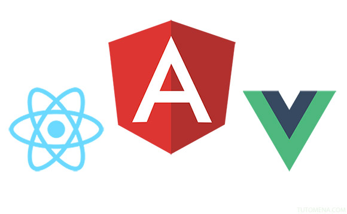

العديد من المتابعين والمهتمين بمجال برمجيات الويب يسألون **كيف أصبح مطور مواقع** ؟ والجواب على هذا السؤال ليس صعبا وسنحاول الإجابة عليه في هذه التدوينة السريعة.

لحسن حظك عزيزي السائل، مجال برمجيات الويب لا يتطلب مسارا أو مسلكا أكاديميا حتى تتكمن من احترافه، وهنا أنا لا أتحدث عن البرمجيات المعقدة كبرمجة نوى أنظمة التشغيل وما إلى ذلك، فهذا النوع من البرمجيات يتطلب مستوى أكاديمي متقدم وفهم جيد لبنية الحاسوب ومكوناته. أن تكون مبرمج ويب محترف يتطلب منك مبدئيا ثلاثة أمور لا رابع لها :

## 1\. الخوارزميات

كلنا درسنا **المنطق** في مادة الرياضيات بالثانوية العامة، هذا الدرس سيجعلنا نتعلم **الخوارزميات** بأريحية تامة، فالخوارزمية هي حل لإشكالية معينة والمنطق هو سلاحنا في تصور الإحتمالات وإيجاد حلول لهذه الإشكالية وكما تعملون فالبرنامج المعلوماتي قبل كل شيء هو خوارزمية.

لذلك أول خطوة في مسارك لتكون **مطور مواقع محترف** هي تعلم الخوارزميات ومبادئ المنطق الرياضي واكتساب مهارات التفكير الرياضي التحليلي المنطقي.

## 2\. تعلم لغة البرمجة

بعد أن تتعلم مبادئ الخوارزميات وإنجاز بعض التمارين الخاصة بها، عليك باختيار لغة برمجة تود التخصص فيها وهنا أنصحك ب PHP، فهي اللغة الأكثر طلبا في السوق.

هناك عدد كبيرا جدا من الدورات والدروس الخاصة بهذه اللغة وغيرها على اليوتيوب يمكنك متابعتها وبعد التمكن من أساسيات اللغة سيكون عليك القيام بتطبيقات عملية وأضع مليون سطر تحت **تطبيقات عملية**.

كمثال عملي، أنصحك بكتابة سكريبت لإدارة مخزن Store Management أو سكريبت لمدونة من الصفر وحاول أن تفهم كل سطر برمجي تكتبه وإياك والنسخ واللصق من دون فهم.

ولا تنسى كذلك الإهتمام الكامل بلغة **الجافاسكريبت** والعمل على فهمها وإتقانها، هذه اللغة ستجدها في كل مكان عندما تنتقل لمجال الإحتراف، سواء كنت مطور PHP، روبي، جافا أو غيرها فالجافاسكريبت ستجدها دائما حاضرة في المشاريع التي ستعمل عليها لذلك عليك الإهتمام بها جيدا.

وإذا كان هدفك أن تكون **مطور واجهات أمامية** Frontend Web Developer فأنت ملزم بتعلم لغات html و css وطبعا الإتقان التام للجافاسكريبت والإطلاع على منصة Node.js لأن المكتبات المبنية عليها أصبحت مستعملة على نطاق واسع في هذا المجال ونذكر منها: Bower، Gulp.js، Gruntjs، Webpack وكلها مكتبات يستعملها معظم مطوري الواجهات الأمامية لتسهيل وأتمتة العمليات المتكررة باستمرار.

## 3\. الإنتقال لإطارات العمل وأنظمة إدارة المحتوى

بعد التمكن من لغة البرمجة التي تود احترافها، عليك البحث عن أحد إطارات عملها الأكثر استخداما وتعلمه ومن ثم إتقانه وإنجاز مشاريع تطبيقية بواسطته. فمثلا لو كنت مطور PHP سأنصحك بإطار العمل **لارافيل** أو **سيمفوني**، بالنسبة لجافا فهناك بيئة العمل الشهيرة **J2EE** لإنشاء تطبيقات الويب، أما البايثون فإطار العمل **Django** هو الأشهر ولا ننسى إطار العمل **Ruby on Rails** الخاص بلغة البرمجة روبي.

أما أنظمة إدارة المحتوى فأشهرها وأكثرها استعمالا هي [**ووردبريس ودروبال**](http://www.tutomena.com/blog/wordpress-vs-drupal/) ولو أتقنت واحدا منها على الأقل فستكون فرصك كبيرة في الحصول على عمل وبأجر معقول ومرضي.

بالنسبة للجافاسكريبت فمكتبة **الجيكويري** لا غنى عن تعلمها وإتقانها في مجال الإحتراف، بعد ذلك سيكون عليك إختيار أحد مكتبات إنشاء تطبيقات أحادية الصفحة Single Page Applications وأبرزها Vue.js، React.js، Angular.js و Backbone.js، هذا إن كنت تنوي احتراف **تطوير الواجهات الأمامية Frontend Development** أما إذا كنت مكتفيا **بالواجهات الخلفية Backend Development** وتطوير الواجهات APIs فجيكويري تكفيك إلى حد بعيد.

## خاتمة

حاولت قدر الإمكان اختصار المسار الذي سيقودك لتكون **مطور مواقع** محترف كما كنت تحلم، المهمة ليست سهلة ولكن بالمقابل ليست صعبة ولا مستحيلة كل ما يتطلبه الأمر هو **الإستمرارية** و**العمل** بجد والبحث عن مشاريع ولو كانت مجانية للعمل عليها واكتساب المهارت الجديدة من خلالها، ولو واضبت على خطتنا هذه فإني أبشرك أنه في غضون 6 إلى 9 أشهر ستكون قد بدأت أولى خطواتك في مسارك كمطور ويب محترف.
