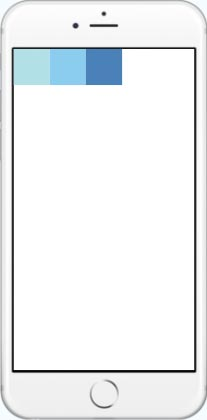

منذ عامين تقريبا، ظهر إطار العمل React Native لبرمجة تطبيقات الموبايل الأصيلة Native باستخدام لغة البرمجة جافاسكريبت. هذا الإطار مدعوم من فيسبوك ويعتمد في كتابة أكواد الجافاسكريبت على فلسفة React.js، إطار العمل الآخر من فيسبوك لتطوير تطبيقات الويب.

## تطبيقات أصلية باستخدام تقنيات الويب

أولى المحاولات الجادة لتطوير تطبيقات المحمول باستخدام لغات البرمجة والتقنيات الخاصة بالويب كانت من طرف Apache Cordova، هذا الأخير يمكننا من عمل تطبيقات هجينة Hybrid وذلك بتضمين أكواد الجافاسكريبت، HTML و CSS داخل عنصر Webview وهو عبارة عن متصفح صغير داخل الجهاز ودمجه فيما بعد في التطبيق. هذا مع إمكانية الوصول لمعظم الواجهات والعناصر داخل الجهاز مثل الكاميرا، قائمة الإتصال وغيرهما، تماما كما لو كنت تبرمج تطبيقا أصليا بواسطة الجافا أو سويفت.

هذه التقنية مكنت مطوري الويب من استخدام اللغات التي اعتادوا عليها لبرمجة تطبيقات الموبايل، ولقد حققت نجاحا كبيرا وكانت ثورة بالنسبة للعاملين في مجال تطبيقات الويب. ولكن مع هذا كله، انطوى **كوردوفا** على عدد من المشاكل والإشكالات التقنية والبنيوية، لعل أبرزها :

- عنصر Webview، باعتباره نسخة مصغرة للمتصفح، يختلف من جهاز لجهاز بل ومن نسخة لنسخة أخرى في نفس النظام، هذا يضعنا أمام مشكل **التوافقية** الذي نواجهه في تطبيقات الويب. هناك [حلول من أجل توحيد ال webview](https://www.tutomena.com/web-development/tools/crosswalk-cordova-plugin/) ولكنها بدورها تنطوي على مشاكل وآثار جانبية مثل الزيادة الواضحة في حجم التطبيق.
- محاكاة المكونات والعناصر الأصلية يعد من الصعوبة بمكان، العمل بالمكونات الأصليه Native Components لواجهة المستخدم UI ليس ممكنا مع **أباتشي كوردوفا** لأننا أصلا نعمل داخل WebView، هذا يفرض علينا اللجوء للإستعانة بأطراف أخرى لتجاوز هذه العقبة، وإطار العمل **Ionic** واحد من أشهر الخيارات في هذا الصدد.
- انخفاض في مستوى الأداء، السرعة  والسلاسة مقارنة بالتطبيقات الأصلية.

**React Native** جاء لتجاوز هذه المعضلات، فهو يمكننا من استخدام المكونات الأصلية الخاصة بكل منصة على حدة (أندرويد، iOS) والتعامل معها بواسطة الجافاسكريبت JavaScript.

import React, { Component } from 'react';
import { AppRegistry, Text } from 'react-native';

class HelloWorldApp extends Component {
render() {
return (
<Text>Hello world!</Text>
);
}
}

AppRegistry.registerComponent('HelloWorldApp', () => HelloWorldApp);

في هذا المثال نلاحظ استعمال المكون <Text> لإظهار نص على الشاشة، وفي الكواليس يقوم React Native بتحويل هذا المكون إلى عنصر أصلي، مثلا TextView بالنسبة لمنصة أندرويد.

والأجمل كذلك أننا نستطيع استخدام أكواد الجافا، Objective-C وسويفت داخل مشروع React Native والعكس صحيح، وهذا بالضبط ما فعله مطورو تطبيق فيسبوك، بعض الأجزاء منه تم تطويرها باستخدام React Native والباقي باستخدام الطريقة الرسمية (Java, Swift,Objective-C).

## نقاط إضافية مهمة عن React Native

### تعلم React.js

قبل الإنقضاض على React Native، حاول أولا إعطاء بعض الوقت لتعلم إطار العمل React.js وفهم طريقة عمله، وكلما زاد إتقانك له زادت فرص إندماجك السريع مع فلسفة RN.

### ECMAScript 6

إطار العمل React Native متوافق مع الإصدار **ECMAScript 6** الخاص بلغة البرمجة جافاسكريبت، هذا أمر رائع يسمح لنا بكتابة كود منظم والإستفادة من أحداث إمكانيات وميزات لغة الجافاسكريبت.

### Styling

لا يعتمد React Native على لغة CSS في تنسيق واجهة المستخدم، بل يقوم بذلك عن طريق الجافاسكريبت نفسها وذلك عن طريق كائنات Objects بخاصيات Properties وقيم Values مثل التي اعتدنا عليها في CSS إلا أنها هنا تكتب بطريقة Camel Case (مثال : backgroundColor عوضا عن background-color).

import React, { Component } from 'react';
import { AppRegistry, StyleSheet, Text, View } from 'react-native';

class LotsOfStyles extends Component {
render() {
return (
<View>
<Text style={styles.red}>just red</Text>
<Text style={styles.bigblue}>just bigblue</Text>
<Text style={[styles.bigblue, styles.red]}>bigblue, then red</Text>
<Text style={[styles.red, styles.bigblue]}>red, then bigblue</Text>
</View>
);
}
}

const styles = StyleSheet.create({
bigblue: {
color: 'blue',
fontWeight: 'bold',
fontSize: 30,
},
red: {
color: 'red',
},
});

AppRegistry.registerComponent('LotsOfStyles', () => LotsOfStyles);

### استخدام Flexbox

بالإضافة ل Styles، يعتمد React Native في تنسيق الواجهات الرسومية على مكون يدعى Flexbox، وتعمل هذه الخوارزمية تماما بنفس طريقة ال Flexbox المستخدم في لغة CSS داخل تطبيقات الويب مع بعض الإختلافات.

import React, { Component } from 'react';
import { AppRegistry, View } from 'react-native';

class FlexDirectionBasics extends Component {
render() {
return (
// Try setting \`flexDirection\` to \`column\`.
<View style={{flex: 1, flexDirection: 'row'}}>
<View style={{width: 50, height: 50, backgroundColor: 'powderblue'}} />
<View style={{width: 50, height: 50, backgroundColor: 'skyblue'}} />
<View style={{width: 50, height: 50, backgroundColor: 'steelblue'}} />
</View>
);
}
};

AppRegistry.registerComponent('AwesomeProject', () => FlexDirectionBasics);

[caption id="attachment_2005" align="aligncenter" width="207"]](../images/react-native-flexbox-demo.jpg) استخدام Flexbox في React Native\

### Learn Once, Write Anywhere

تعلم مرة واحدة واكتب في كل مكان، هذا هو شعار إطار العمل React Native، فتعلمك لهذه التقنية سيمكنك من برمجة تطبيقات لكل من أندرويد و iOS، نعم ستعمل على مشروعين مختلفين ولكن بنفسك لغة البرمجة ونفس التقنية :)

---

ليس هناك اختلاف كبير بين React.js و React Native، إذا كانت لك تجربة مع الأول فلن تجد صعوبة في بدء مشوارك ببرمجة تطبيقات الموبايل بواسطة الثاني. هذه التقنية [حظيت بثقة عدد من كبار الفاعلين الإقتصاديين](https://facebook.github.io/react-native/showcase.html) مثل سلسلة متاجر والمرت Walmart ومنصة Airbnb الشهيرة وطبعا تطبيقي فيسبوك وانستاغرام يعتمدان في أجزاء منهما على React Native. هذا يدفعني للتفاؤل بمستقبل كبير لهذا الإطار وهو لايزال قيد التطوير والتحسين.

إذا كانت لديك، صديقي المتابع، ملاحظات أو استفسارات حول الموضوع فسأكون سعيدا جدا بطرحها في صندوق التعليقات بالأسفل.

**مراجع :**

الأمثلة والصور في هذا المقال من [الموقع الرسمي ل React Native](https://facebook.github.io/react-native/).
