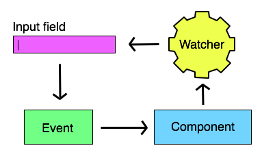
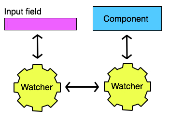

منذ ظهور أطر عمل الجافاسكريبت، أصبحت عبارتي Tw-way data binding و One-way data binding من أكثر العبارات والمصطلحات التقنية التي نسمعها ونقرؤها في الدورات والدروس المتعلقة بهذه الأطر (مثال: Angular و React).

## ما معنى Data Binding ؟

الترجمة اللغوية الحرفية لمصطلح Data binding هو **ربط البيانات**. واصطلاحا هو الآلية التي يتم بها تنظيم ربط أو تدفق البيانات بين نموذج البيانات (_Model_) وواجهة المستخدم (_User Interface_).

المقارنة بين آليتي تدفق البيانات أحادي الإتجاه (One-way) وثنائي الإتجاه (Two-way) طفت على السطح وبقوة في الأربع سنوات الأخيرة في ظل المقارنات بين إطار العمل Angular و مكتبة React.js. الأول يتبنى آلية Two-way data binding والثاني يعتمد آلية One-way data binding.

## تدفق البيانات ثنائي الإتجاه في إطار العمل Angular

لطالما عرف إطار العمل أنغولار باعتماده على نمط Two-way data binding  منذ إصداره الأول. هذا النمط ببساطة يتجلى في أن أي تغيير يطرأ على قيم نماذج البيانات (_Data Model_). يؤدي ضمنيا لتغيير واجهة المستخدم (تحديثها) والعكس صحيح، أي أن الزائر عندما يقوم بتغيير قيمة حقل ما (_Input_) فإن ذلك يعني تغييرا لنموذج البيانات المقابل لهذا الحقل.

لنأخذ هذا المثال البسيط لتوضيح المسألة أكثر، ليكن هذاهو الكود الخاص بواجهة المستخدم :

    Name: <input ng-model="name">
    <h1>{{name}}</h1>

وهذا الكود الخاص بال _Controller_ :

function MyController($scope) {
	$scope.name = "Ahmed";
}

كل تغيير يطرأ على مستوى واجهة المستخدم من خلال الحقل <input> سيقابله تغيير تلقائي في قيمة $scope.name  داخل ال Controller، وبالتالي سنرى أن قيمة {{name}} داخل الوسم <h1> تتغير بدورها.

## تدفق البيانات أحادي الإتجاه في React.js

في عالم React.js تختلف الأمور قليلا. في المثال أعلاه، نستطيع كما قلنا إجراء تحديثات على مستوى HTML ليتم مزامنتها أوتوماتيكيا مع كود الجافاسكريبت (_Data Model_).

هذا لا يحدث مع مكتبة React.js.

بكل تأكيد نستطيع أخذ قيمة الحقل وتحديث حالة المكون (_Component_) أو واجهة المستخدم، ولكن الإختلاف أن العملية هنا ليست ضمنية (_Implecit_) أو تلقائية لأنه يجب علينا أن نقوم بذلك بشكل صريح (_Explecit_). الطريقة هي أننا نقوم بالإستماع لحدث _onChange_ الذي يتم إطلاقه عندما يطرأ تغيير على قيمة <input> وبعد ذلك نقوم بتغيير حالة واجهة المستخدم (UI State) بشكل يدوي عن طريق الواجهة البرمجية التي تتيحها لنا React.js.

لاحظوا المثال التالي :

class App extends React.Component {
constructor() {
super();

    this.handleChange = this.handleChange.bind(this);

    this.state = {
      name: 'Ahmed',
    };

}

handleChange(event) {
this.setState({
name: event.target.value,
});
}

render() {
return (

<input type="text" value={this.state.name} onChange={this.handleChange} />
<h1>{this.state.name}</h1>

);
}
}

نقوم باستخدام الدالة setState()  لتغيير قيمة _name_. وكما نعلم فإنه كلما قمنا بتغيير الحالة عن طريق setState()  فإن دالة _render_ الخاصة بالمكون يتم إعادة استدعاؤها من قبل *React.js* من أجل تحديث واجهة المستخدم :)

React.js حريص على أن يكون **State** هو "المصدر الوحيد للحقيقة" (_Single source of truth_)، فكل ما تقوم به واجهة المستخدم هو إطلاق أحداث _Events_ عندما يطرأ تغيير عليها حتى يعلم المكون متى عليه أن يقوم بتحديث نفسه بواسطة أسلحته الخاصة (_()_setState__).

يمكن لهذا الرسم أن يجعل الأمور أكثر وضوحا:

بينما في حالة AngularJs، كانت الأمور ستبدو على هذا النحو :

## النهاية

أرجو أن يكون هذا الموضوع أكثر وضوحا بالنسبة لكم الآن.

لم أرد الخوض في بعض التفاصيل كثيرا، كأن أشرح مثلا أن إصدار _Angular 2 فما فوق_ يدعم كلا النمطين، لأن هدفي الوحيد من خلال هذا الدرس هو شرح الفرق بين هذين الشكلين من الآليات التي تعتمدها معظم أطر عمل الجافاسكريبت لتنظيم العلاقة بين واجهة المستخدم والبيانات. وإنما استخدمت مثالي React.js و AngularJS فقط لشعبيتهما عند معظم مطوري الجافاسكريبت حول العالم.
