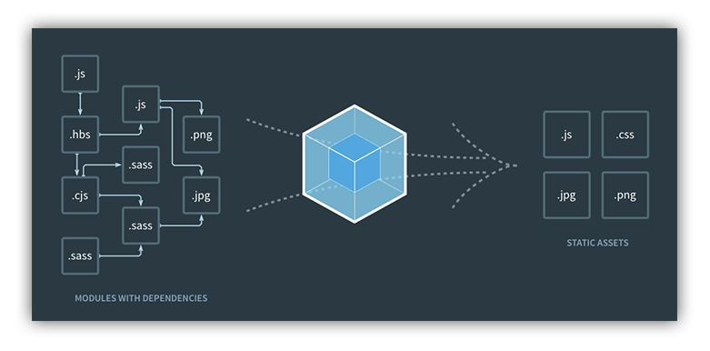

أصبح **Webpack** في السنوات القليلة الماضية واحدة من القطع الأساسية في العتاد التي يستخدمه مطورو الواجهات الأمامية لتطبيقات الويب.

مشاريع وحزم كبيرة من قيمة Angular CLI ،Create-React-App و Vue CLI تعتمد بشكل رسمي على أداة _Webpack_، ولا شك بأنك لاحظت ملفات من نوع _webpack.config.js_ عند استعمالك لتلك الحزم، إنها الملفات الخاصة بإعداد **ويب باك** لكي يعمل وفقا لإحتياجاتنا.

فما هو إذن Webpack ؟ وكيف ساهم في إغناء وتطوير بيئة عمل مطوري تطبيقات الويب الحديثة ؟ وما هي المزايا ونقاط القوى التي جعلته يتصدر المشهد بهذه السرعة، والتفوق على كل المنافسين الذين كانوا في الساحة قبل ظهوره ؟

سنجيب على كل هذه الأسئلة في هذه التدوينة، مع الإشارة إلى أن هذا الموضوع **سيطغى عليه الجانب النظري** حتى نفهم جيدا ماهية Webpack ودوره الحقيقي، على أن نؤجل التطبيق العملي إلى موضوع آخر قادم إن شاء الله.

## ما هو Webpack ؟

**ويب باك** هو أداة بناء (_Build tool_) ويسمى أيضا مجمع أو محزم وحدات (Module Bundler) يستخدم في تطبيقات الويب لجعل عدد من أنواع الملفات المكونة للتطبيق كتبعيات يمكن استدعاؤها عند الحاجة عن طريق الدالة **()require**. هذه الملفات يمكن أن تكون جافاسكريبت، CSS أو حتى صور و ملفات الخطوط (_Fonts_).

يمكن الإستفادة من إمكانيات **ويب باك** في المشاريع التي تنطوي على مستوى معين من التعقيد، حيث الإستخدام المكثف لجافاسكريبت على شكل وحدات (_Modules_) أو حزم متعددة. بينما لا يكتسب Webpack أهمية كبرى في التطبيقات البسيطة حيث لا يوجد سوى ملف جافاسكريبت واحد، ولا تصل لدرجة التعقيد التي تستوجب تقسيم الكود إلى عدة وحدات.

## لنعد قليلا إلى الوراء

لنعد قليلا إلى الماضي القريب، لنرى كيف كنا نقوم بإدارة التبعيات في مشاريعنا.

الطريقة الشائعة في تلك الأيام كانت إضافة ملفات الجافاسكريبت واحدا تلو الآخر ـ مع مراعاة الترتيب ـ عن طريق الوسم 

هذه الطريقة غير جيدة لعدة أسباب، أولا أننا نقوم بعدة طلبات HTTP لجلب الملفات المعنية، ما يعني استهلاكا أكثر للخادم والزيادة في وقت تحميل الصفحة.

لتجاوز مشكل تعدد طلبات HTTP تم التفكير في جمع أكواد وملفات لجافاسكريبت كلها في ملف واحد باستخدام **Grunt** أو **Gulp**.

// جمع الملفات
var scripts = [
'jquery.min.js',
'jquery.some.plugin.js',
'main.js'
].concat().uglify().writeTo('bundle.js');

// الملف الذي يتم بناؤه واستدعاؤه

نحن الآن قمنا بحل مشكل تعدد الملفات المحملة، ولكن لا نزال نواجه مشاكل أخرى متعقلة أولا بالترتيب الواجب مراعاته قبل جمع الملفات، ثم المشكل الأكبر وهو الإستعانة **بالمتغيرات العامة** ( _Global variables_ ) وبالتالي خطورة وإمكانية حدوث تعارض بينها.

في مثالنا أعلاه، نقوم باستدعاء مكتبة **جيكويري** التي تقوم بإنشاء وتوفير متغير عام هو الدالة jQuery التي نقوم باستخدامها في شفرتنا المصدرية. هذا المتغير العام يمكن لملف تم تحميله بعد مكتبة جيكويري أن يقوم باستخدامه وإجراء تعديل عليه أو استخدام متغير آخر بنفس الإسم وبالتالي تحطيم وإلغاء المتغير الأول... مثل هذه المشاكل شائعة وتصادف خاصة المطورين الجدد الذي لا يستوعبون جيدا **مفهوم النطاق** أو Scope في جافاسكريبت.

- [موضوع ذو صلة : كيف وصل النظام البيئي لجافاسكريبت إلى ما هو عليه اليوم ؟ ](https://www.tutomena.com/web-development/javascript/javascript-ecosystem-history/)

### ظهور محزم الوحدات Browserify

للأسباب أعلاه، ظهرت مجموعة من محزمات الوحدات بغرض تفكيك أكواد تطبيقاتنا إلى عدة وحدات قابلة للإستيراد عند الحاجة، مع الحفاظ على نطاقتها نقية ومحمية من أي تعارضات أو تصادمات مع نطاقات الوحدات الأخرى في الحزمة النهائية.

اعتمد Browserify على طريقة **CommonJS** في عملية تصدير واستيراد وحدات الجافاسكريبت المكونة للتطبيق، على شاكلة Node.js، أي باستخدام الدالة **()require**.

// config.db.js
module.exports = { driver: "mysql" };

// app.js
var config = require('./config.db.js');  
console.log('Database Driver : ', config.driver);

بهذا تم تجاوز مشكل عدم دعم المتصفحات لخاصية الوحدات في جافاسكريبت. ولعب بذلك **Browserify** دورا هاما في استنساخ واحدة من أهم مزايا _Node.js_ ونقلها لعالم المتصفحات.

## وما هو دور Webpack إذن ؟ بماذا يختلف عن Browserify ؟

قلنا بأن Browserify جاء بهدف واحد وواضح، هو نقل **ميزة التصدير والإستيراد لوحدات الجافاسكريبت** إلى عالم المتصفحات، بعدما كنا نراها فقط في Node.js، أي في الخوادم.

أما Webpack، وهذه هي ميزته الأساسية، فيجعل في استطاعتنا استيراد جميع أنواع تبعيات المشروع (ليس الجافاسكريبت فقط) من صور، خطوط، ملفات CSS قد تكون على شكل SASS أو LESS... ففي التطبيقات الحديثة، مثل تطبيقات React.js، التي تعتمد على مفهوم المكونات أو Components قد نرى فيها أكوادا من هذا القبيل :

require('./stylesheets/main.scss')

وفي ملف ملف إعدادات ويب باك _webpack.config.js_، نقوم باخبار Webpack بأن يقوم بتحويل العبارة أعلاه إلى أكواد CSS وإضافتها لوسم <style> في الصفحة عن طريق ما يعرف في عالم Webpack ب **Loaders**. في حالتنا نقوم باستخدام 3 من Loaders هي **style-loader** ،**css-loader** ،**sass-loader** بعد أن نقوم بتثبيتها في المشروع عن طريق مدير الحزم npm.

module: {
rules: [
...
{
test: /\.scss\$/,
use: [
{
loader: "style-loader" // creates style nodes from JS strings
},
{
loader: "css-loader" // translates CSS into CommonJS
},
{
loader: "sass-loader" // compiles Sass to CSS
}
]
}
]
}

نفس الكلام يقال عن الصور، فلا تستغرب عندما تجد هذا الكود في أحد المشاريع :

**ويب باك** يقوم بالبحث في الملف ليجد الدالة **()require** فيقوم بتعويضها بما يناسب (رابط الصورة مثلا) بحسب ال **Loader** المستخدم، في حالة الصور يتم استخدام loader اسمه **file-loader، **ثم بعد ذلك يمكن أن نقول ل Webpack بأن يقوم بنقل الصورة إلى مجلد خاص، مثلا **public/**. **هذا يعني بأن Webpack لا يقوم فقط بعملية بناء وتجميع الحزم والوحدات، بل يستطيع كذلك التحكم في نظام ملفات المشروع بشكل كامل بحسب إعداداتنا**. وبالتالي فإن **ويب باك** جمع بين مزايا مشغلات المهام مثل Gulp و Grunt وكذلك محزمات الوحدات مثل Browserify.

## النهاية

للوهلة الأولى، قد يبدو التعامل مع **Webpack** أمرا صعبا ويستهلك كثيرا من الوقت من أجل إعداده بما يتوافق مع احتياجاتنا. ولكن عند فهم طريقة عمله جيدا وبعد الإعتياد عليه، سيوفر علينا كثيرا من المجهودات ويجعل بيئة عملنا رائعة وعملية.

يضمن Webpack **استدعاء الأكواد والملفات التي نريدها في الوقت الذي نحتاجها فيه فقط**، وعالم تطبيقات الويب اليوم يعتمد بقوة على هذه الخاصية بالنظر إلى بنية المكونات (_Components_) التي باتت تحكمه مع القابلية لإعادة الإستخدام (_Reusability_) التي توفرها.
