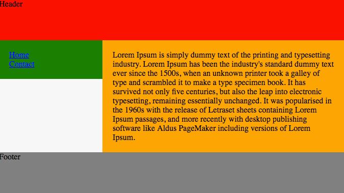
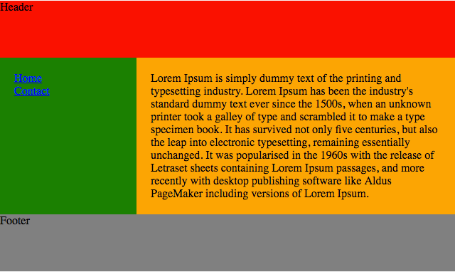
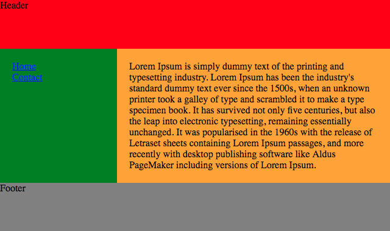
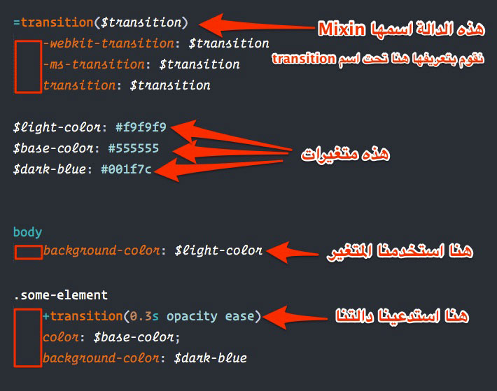
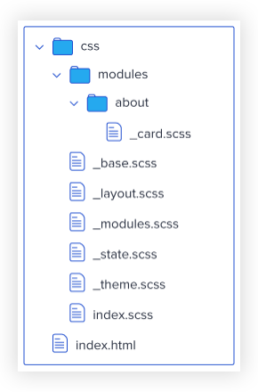

يمكن اعتبار **لغة تنسيق صفحات الويب**، المعروفة اختصارا ب **CSS**، من أبسط اللغات في مجال تطوير الويب وأسهلها على المبتدئين.

يمكن تعلم ما يكفي من CSS في غضون ساعات قليلة للبدء في استخدامها في أي مشروع، ولكن الأمور تزداد تعقيدا وصعوبة كلما كان حجم المشروع كبيرا ويتطلب تنظيما خاصا ومفهوما في طريقة كتابة أكواد CSS حتى لا تخرج الأمور عن السيطرة ويظل الكود واضحا ومرتب بشكل جيد.

هناك عدة مقاربات وطرق للتعامل مع أكواد CSS المتشعبة والمعقدة، ولكن مع الأسف، لا يوجد أي إجماع واضح من طرف المطورين حول طريقة بحد ذاتها. ربما هذا ما يجعل عالم CSS يبدو مخيفا من الوهلة الأولى بالنسبة للمبتدئ، الذي مما إن يقرر البدء في تعلم أساسيات **تطوير واجهات الويب الرسومية** حتى يجد في طريقه سيلا من الأدوات والمصطلحات التي لا يفهم منها شيئا ولا يدري دورها وكيف أصبحت جزءًا من بيئة CSS وتطوير الويب بصفة عامة. أسماء مثل BEM ،SMACSS ،SASS ،LESS وغيرها الكثير أغنت في السنوات الأخيرة عالم CSS ولكن من آثارها الجانبية أن جعلته كذلك أكثر تعقيدا وغموضا خاصة بالنسبة للمستجدين في الميدان.

سأحرص في هذا الموضوع ـ كما فعلت سابقا عندما [شرحت تاريخ تطور النظام البيئي لجافاسكريبت](https://www.tutomena.com/web-development/javascript/javascript-ecosystem-history/) ـ على شرح كل تلك الأدوات التي تستشكل على البعض، مع توضيح أدوارها وسبب تواجدها في هذا الملعب، ملعب CSS.

قد يكون الموضوع طويلا إلى حد ما، لذلك سأقترح عليك صديقي ـ كما أفعل دائما :) ـ إعداد فنجان من الشاي والجلوس مرتاحا إلى حين إتمامك قراءة المقال، أنا متأكد بأنه سيضيف إلى رصيدك المعرفي أشياء جديدة.

## **استخدام الجداول مع بداية الويب**

في بداية تسعينات القرن الماضي، كان الويب في أيامه الأولى ولم يكن CSS بالتطور الذي نشهده اليوم.

كان CSS يستخدم فقط في عمليات بسيطة مثل تنسيق أحجام الخطوط، تعيين الألوان، إضافة الهوامش إلخ... فصفحات الويب آنذاك كانت عبارة عن وثائق شبيهة بلمفات Word النصية إلى حد بعيد :) وبالتالي لم نكن نتكلم عن تصاميم ديناميكية ومخصصة كما نعرفها اليوم.

في تلك الفترة، كانت الوسيلة الوحيدة المجمع عليها لتخطيط وتصميم الصفحات ،وخلق المناطق فيها، هي استخدام الجداول <table> التي مازالت موجودة إلى اليوم في لغة HTML. وبالتالي كنا نجد أن الصفحة برمتها عبارة عن عنصر <table> وبداخله صفوف وأعمدة (Rows & Columns).

شخصيا، عشت تجربة استخدام الجداول في بداية عملي كمطور ويب، عندما كنا نقوم بإنشاء قوالب النشرات البريدية (Newsletters) التي كان يجب عليها ـ بشكل قاطع ـ أن تصمم باستخدام الجداول فقط ولا يتم استخدام عناصر HTML الأخرى مثل <div> أو <p> وكذلك Float Layout لأن خدمات البريد مثل _Gmail_ ،_Hotmail_ ،_Outlook_ لا تدعمها.

بصراحة، استخدام الجداول لتنسيق صفحات الويب لم يكن حلا جيدا، لأنه إن حدث وأردنا تغيير التصميم والتعديل عليه فسنكون مجبرين على تحرير ملف HTML وتغيير بنية الجدول وليس عن طريق ملفات CSS كما نفعل في أيامنا هذه.

## **بداية عهد Float Layout**

من يرى استخدامات خاصية **float** في أيامنا هذه ربما لن يصدق بأن الغرض الأصلي منها كان أبسط من ذلك بكثير.

إنما كان الغرض الأساسي من هذه الخاصية إتاحة طريقة لجعل الصور - بصفة خاصة - **تطفو** على يسار أو يمين النصوص لجعل الأخيرة تلتف حولها، وقد استمدت هذه الفكرة من طريقة عرض الصور في الجرائد والمجلات الورقية.

[](../images/float-web-text-wrap.png) الصورة من موقع css-tricks.com

ولعل اسم Float يعتبر منطقيا بالنظر إلى ذلك الدور، حيث أن الصورة هنا عبارة عن _مركب يطفو على مياه النصوص_ :D

ولكن بعد ذلك لاحظ مصمموا الويب بأنه يمكن استغلال هذه الصفة لإنجاز تصاميم أعقد وأكثر تقدما، وقد نجحوا في ذلك حيث لعب Float Layout دورا كبيرا في تطور تصاميم الويب في العشرية الأولى من القرن الحالي.

[](../images/float-web-layout.png) الصورة من موقع css-tricks.com

ولكن رغم ذلك، كانت لهذه الطريقة عيوبا كثيرة وآثارا جانبية كان على المصممين إيجاد حلول ترقيعية لها إما بواسطة CSS نفسه أو بواسطة جافاسكريبت. ولعل أكثر المشاكل التي كنا مجبرين على حلها بواسطة الجافاسكريبت هو مشكلة عدم تساوي ارتفاع كل من الشريط الجانبي (_Sidebar_) ومنطقة المحتوى (_Main Content_)، خاصة إذا كان كلاهما يمتلك خلفية ملونة (_Background Color_).

### كود HTML

```html
<header>
  Header
</header>

<aside>
  <a href="#">Home</a><br />
  <a href="#">Contact</a>
</aside>

<main>
  Lorem Ipsum is simply dummy text of the printing and typesetting industry.
  Lorem Ipsum has been the industry's standard dummy text ever since the 1500s,
  when an unknown printer took a galley of type and scrambled it to make a type
  specimen book. It has survived not only five centuries, but also the leap into
  electronic typesetting, remaining essentially unchanged. It was popularised in
  the 1960s with the release of Letraset sheets containing Lorem Ipsum passages,
  and more recently with desktop publishing software like Aldus PageMaker
  including versions of Lorem Ipsum.
</main>

<footer>
  Footer
</footer>
```

### كود CSS

```css
 {
  box-sizing: border-box;
}
header {
  height: 80px;
  background: red;
}
aside {
  width: 30%;
  float: left;
  padding: 20px;
  background: green;
}
main {
  width: 70%;
  float: left;
  padding: 20px;
  background: orange;
}
footer {
  height: 80px;
  clear: both;
  background: grey;
}
```

- ### **النتيجة**

[](../images/float-based-layout.png)

كان الحل يكمن في حساب قيمة الطول الأكبر (_عادة ارتفاع منطقة المحتوى_) بواسطة _jQuery_ وتعيين هذه القيمة للعنصر ذو الإرتفاع الأصغر (_الشريط الجانبي مثلا_) في بداية تحميل الصفحة. ولا يمكن استخدام صفة height في ملف CSS هنا لأن طول المحتوى يتغير من صفحة إلى أخرى وبالتالي لا يمكن إعطاء قيمة ثابتة له ;)

هذه حالة واحدة فقط من مجموعة من الحالات التي نلمس فيها محدودية نظام Float في تصميم واجهات الويب الرسومية. وقد كان على مصممي الويب التعايش مع هذا الواقع إلى حين ظهور نظام آخر مصمم خصيصا لإنجاز تصاميم معقدة ويوفر كافة الخصائص والمزايا المطلوبة في تصاميم الويب الحديثة.

طال انتظار هذا النظام قليلا، ولكنه جاء أخيرا في عام 2015 تحت مسمى **CSS Flexbox**.

## **نظام Flexbox في Css**

في الحقيقة، الظهور الأول لنظام Flexbox كان في عام 2009، ولكن دعم المتصفحات في ذلك الوقت كان ضعيفا وتقريبا لا يذكر. لذلك يمكن اعتبار 2015 عام الميلاد الحقيقي لهذا النظام حين بات مدعوما ومعترفا به من كافة المتصفحات المعروفة (طبعا باستثناء الذي لا أريد ذكر اسمه :) أنتم تعرفونه جيدا).

ولعل مسارعة العديد من أطر العمل المشهورة لتصميم الواجهات الأمامية إلى اعتماد Flexbox تدل بما لا يدع مجالا للشك على الأهمية الكبيرة لهذا المولود الجديد وإلى أي درجة كان الكل ينتظرون قدومه. فإذا كنت تستخدم [بوتستراب 4](https://www.tutomena.com/web-development/html-css/what-is-new-in-bootstrap-4/) أو **Zurb Foundation 6** فإنك بلا شك لاحظت بأنهما يعتمدان في النظام الشبكي (_Grid System_) على Flexbox وتخلصا بشكل نهائي من طريقة Float.

مع هذه التقنية الجديدة، أصبح بإمكان المصممين إنجاز تصاميم معقدة بكيفية جديدة وأكثر تخصصا، وبفضلها تخلصنا بشكل نهائي من عديد المشاكل التي كانت تواجهنا في طريقة العمل القديمة.

### كود HTML

```html
<header class="header">
  Header
</header>

<div class="container">
  <aside>
    <a href="#">Home</a><br />
    <a href="#">Contact</a>
  </aside>

  <main>
    Lorem Ipsum is simply dummy text of the printing and typesetting industry.
    Lorem Ipsum has been the industry's standard dummy text ever since the
    1500s, when an unknown printer took a galley of type and scrambled it to
    make a type specimen book. It has survived not only five centuries, but also
    the leap into electronic typesetting, remaining essentially unchanged. It
    was popularised in the 1960s with the release of Letraset sheets containing
    Lorem Ipsum passages, and more recently with desktop publishing software
    like Aldus PageMaker including versions of Lorem Ipsum.
  </main>
</div>

<footer>
  Footer
</footer>
```

### كود CSS

```css
 {
  box-sizing: border-box;
}
header {
  height: 80px;
  background: red;
}
.container {
  display: flex;
}
aside {
  flex: 0 0 30%;
  padding: 20px;
  background: green;
}
main {
  flex: 0 0 70%;
  padding: 20px;
  background: orange;
}
footer {
  height: 80px;
  clear: both;
  background: grey;
}
```

- ### **النتيجة**

[](../images/flexbox-based-layout.png)

نلاحظ بأننا قمنا بإضافة عنصر جديد في html وهو _**div.container**._ هذه خطوة ضرورية حتى نتمكن من تطبيق تقنيات flexbox على العناصر الموجودة بداخله.

على كل حال، موضوع flexbox كبير ولذلك سبق لنا أن خصصنا له مقالا كاملا لشرح أهم مزاياه، ويمكنكم الرجوع إليه من خلال [هذا الرابط](https://www.tutomena.com/web-development/html-css/what-is-new-in-bootstrap-4/).

## **نظام Grid Layout**

قلنا في السابق بأن نظام **Flexbox** ممتاز في رسم تصاميم الويب الحديثة، ولكن هناك نظام أحدث ربما لم ينل حقه من الشهرة بعد وهو **CSS Grid**.

الفرق بين Flexbox Layout و Grid Layout هو أن الأول مصمم لإنشاء تصاميم ذات بعد واحد (_Row_ أو _Column_)، بينما الثاني ملائم أكثر للتصاميم الأكبر ذات الأبعاد الأفقية والعمودية معا في نفس الوقت. ويمكن استخدام النظامين معا في ذات الوقت، فالمسألة كلها متعلقة بطبيعة التصميم واستيعاب مصمم الويب لدور وحقيقة كل من التقنيتين على حدة.

لتفصيل أكبر في هذا الموضوع، هناك [شرح ممتاز من مجتمع شبكة مطوري موزيلا يشرح الفرق بين Flexbox و Grid](https://developer.mozilla.org/en-US/docs/Web/CSS/CSS_Grid_Layout/Relationship_of_Grid_Layout).

### كود HTML

```html
<header class="header">
  Header
</header>

<div class="container">
  <aside>
    <a href="#">Home</a><br />
    <a href="#">Contact</a>
  </aside>

  <main>
    Lorem Ipsum is simply dummy text of the printing and typesetting industry.
    Lorem Ipsum has been the industry's standard dummy text ever since the
    1500s, when an unknown printer took a galley of type and scrambled it to
    make a type specimen book. It has survived not only five centuries, but also
    the leap into electronic typesetting, remaining essentially unchanged. It
    was popularised in the 1960s with the release of Letraset sheets containing
    Lorem Ipsum passages, and more recently with desktop publishing software
    like Aldus PageMaker including versions of Lorem Ipsum.
  </main>
</div>

<footer>
  Footer
</footer>
```

### كود CSS

```css
header {
  height: 80px;
  background: red;
}
.container {
  display: grid;
  grid-template-columns: 30% 70%;
}
aside {
  padding: 20px;
  background: green;
}
main {
  padding: 20px;
  background: orange;
}
footer {
  height: 80px;
  clear: both;
  background: grey;
}
```

### النتيجة

[](../images/grid-based-layout.png)

تجدر الإشارة إلى أن **CSS Grid** لا يحظى بنفس الدعم من المتصفحات الكبيرة الذي تحظى به تقنية Flexbox، إلى حدود الوقت الذي نكتب فيه هذه الأسطر. لذلك ربما استقر مطورو بوتستراب وإخوانه على Flexbox لكي يدعموا أكبر عدد ممكن من المتصفحات والأجهزة.

## **ظهور معالجات CSS أو CSS Preprocessors**

### 1. Sass

كان **Sass** هو أول معالجات CSS التي ظهورت، كان ذلك في عام 2006. والهدف هو تمكين المطورين من كتابة أكواد CSS بطرق متقدمة، مستلهمين بعضا من مزايا لغات البرمجة مثل المتغيرات، الدوال (Mixins)، الحلقات (Loops) والتعابير الشرطية (If). كل هذا سيجعل كتابة أكواد CSS تتم بسرعة أكبر وسيساعد المطورين على استخدام تقنيات ومزايا ليست متوفرة بعد بشكل رسمي في CSS. سميت هذه المعالجات بهذا الإسم لأنها تقوم بمعالجة تلك الأكواد وتحويلها إلى أكواد CSS اعتيادية، ففي النهاية المتصفحات لا تفهم شيئا آخر غير CSS العادي الذي نعرفه جميعا :)

لإستخدام Sass في ذلك الوقت، كان علينا تثبيت لغة **Ruby** في جهازنا لأن Sass مبني على هذه اللغة، ثم نقوم بعد ذلك بتثبيت حزمة _Sass gem._ وبعد أن تتم هاتين العمليتين بنجاح، سيمكننا استخدام sass عن طريق نافذة الأوامر السطرية بهذا الشكل لتحويل ملفات Sass إلى ملفات Css :

```
sass index.sass index.css
```

طريقة كتابة أكواد Sass تختلف عن الطريقة التي نكتب بها شفرات Css. في Sass لا توجد هناك معقوفات أو فواصل منقطة في نهاية كل سطر، بل فقط نقوم باستخدام المسافات الفارغة (Indentation) لتنظيم لكود.

لاحظوا هذا المثال :

[](../images/sass.jpg)

ويمكن للعناصر أن تتداخل (Nesting) بشكل لا نهائي، حيث يمكننا مثلا إضافة تنسيق للعنصر **child-element.** الموجود داخل العنصر **some-element.** بهذه الطريقة :

```sass
.some-element
+transition(0.3s opacity ease)
color: $base-color;
	background-color: $dark-blue
.child-element
padding: 20px
border: 1px solid $light-color
		color: $light-color
```

هذا كله جميل، ولا يمكن إلا أن نحيي مطوري هذه التقنية الجميلة.

مع هذا، هناك نقطة سلبية وأظن أن أغلب من سبق له التعامل مع Sass قد قام بملاحظتها، إنها طريقة كتابة الأكواد.

بكل صراحة، أنا لا أحب طريقة Sass في تنظيم وكتابة الكود، فهي وإن كانت تشبه **قليلا** الطريقة المعتمدة في Css، إلا أنها تتطلب الكثير من **الإنتباه والتركيز**، فمجرد كتابة فاصلة أو أن المسافة الفارغة (_Indentation_) غير صحيحة سيعتبر ذلك بمثابة خطأ.

هذا المشكل يزول عند التعود ولكن في الأيام الأولى حتما يعاني كل المطورين من هذه النقطة.

### 2. Less

شهد عام 2009 ظهور معالج **Less** الذي اعتبر أول منافس حقيقي ل Sass.

جاء Less تقريبا بجميع المزايا الموجودة في Sass، ولكنه تميز بطريقته الخاصة في كتابة الكود، وهي طريقة تشبه كثيرا طريقة كتابة أكواد CSS، بل إن **كل كود CSS يعتبر متوافقا بشكل كامل مع Less**. يعني أن تركيب Less هو نفسه تركيب Css مضاف إليه مزايا أخرى.

لاحظوا المثال التالي:

```less
.transition(@transition) {
  -webkit-transition: @transition;
  -ms-transition: @transition;
  transition: @transition;
}

@light-color: #f9f9f9;
@base-color: #555555;
@dark-blue: #001f7c;

body {
  background-color: @light-color;
}

.some-element {
  .transition(0.3s opacity ease);
  color: @base-color;
  background-color: @dark-blue;
}
```

نفس المزايا التي رأيناها في Sass، إلا أن التركيب (Syntax) مختلف في Less، **@** عوض **$** في بداية المتغيرات، **النقطة** في بداية دالة ال **Mixin** عوض علامة **+** بالإضافة لاستخدام **المعكوفات** و**الفواصل المنقطة** في نهاية السطر مثلما هو الحال في CSS.

### 3. عودة إلى Sass

مع ازدياد شعبية Less في أساط المطورين بفضل تركيبه القريب من Css، شعر القائمون على Sass بضرورة التصرف بسرعة حتى لا يفوتهم الركب، فقاموا في عام 2010 بابتداع طريقة جديدة اسمها **Scss** استلهموا فيها طريقة Less، حيث وفرت إمكانية استخدام المعكوفات والفواصل والمزيد من التغييرات الأخرى.

```sass
@mixin transition($transition) {
	-webkit-transition: $transition;
  -ms-transition: $transition;
	transition: $transition;
}

$light-color: #f9f9f9;
$base-color: #555555;
$dark-blue: #001f7c;

body {
  background-color: $light-color ;
}

.some-element {
  @include transition(0.3s opacity ease);
  color: $base-color;
  background-color: $dark-blue;
}
```

### 4. Stylus

هناك بديل آخر لكل من Sass و Less، إنه **Stylus**. يشبه كثيرا Sass مع بعض المزايا الخاصة بطبيعة الحال.

**Stylus** مبني على **Node.js** وكان ظهوره الأول في عام 2010.

هؤلاء الثلاثة هم الأكثر شعبية والأكثر استخداما من طرف مطوري واجهات الويب الأمامية. ويظل Sass متفوقا على منافسيه في الشعبية كونه يوفر طريقتين أو تركيبين لكتابة الكود، حتى أن **Bootstrap** الذي كان يعتمد على Less في الإصدار 3 انتقل إلى Sass في إصداره الأخير [بوتستراب 4](https://www.tutomena.com/web-development/html-css/what-is-new-in-bootstrap-4/).

## **نوع آخر من معالجات CSS**

هناك نوع آخر من معالجات لغة Css تختلف عن Sass وأخواتها في كيفية عملها ولكنها تتشارك جميعا نفس الهدف، هذه المعالجات معروفة باسم **Postprocessors** وأشهر معالج من هذا النوع على الإطلاق هو [PostCSS](https://postcss.org/).

يقوم هذا الجيل الجديد من معالجات ال CSS باستخدام جافاسكريبت لتحليل وتحويل أكواد CSS. وهنا نتحدث فعلا عن ملفات CSS حقيقية وليست ملفات مكتوبة بصيغة أو تركيب آخر مثلما هو الحال في معالجات **Preprocessors**.

على سبيل المثال، يمر **PostCSS** على ملف Css ويقوم بتحليله ثم يقوم بمعالجة وتحويل الأكواد التي تحتاج إلى ذلك بناء على إعداداتنا وعلى الإضافات المستخدمة. نتحدث عن الإضافات لأن PostCSS يعتمد على نظام للإضافات، وكل إضافة مسؤولة عن إجراء أو عملية معينة. فمثلا عند استخدام إضافة [autoprefixer](https://github.com/postcss/autoprefixer)، يقوم PostCSS بالمرور على كود CSS وإضافات البادئات (_Prefixes_) إلى جميع الخصائص (_Properties_) التي تحتاج إليها لضمان العمل بشكل جيد على كافة المتصفحات.

فمثلا عند الوصول للكود التالي :

```css
.example {
  user-select: none;
}
```

سيقوم PostCSS (عن طريق إضافة _autoprefixer_) بتحويله لما يلي :

```css
.example {
  -webkit-user-select: none;
  -moz-user-select: none;
  -ms-user-select: none;
  user-select: none;
}
```

يعني أن إضافة البادئات أصبح مسألة **أتوماتيكية** ولم نعد مطالبين بإضافتها يدويا.

في Sass أو Less نقوم بتعريف ال Mixins لهذا الغرض، مثلما فعلنا أعلاه مع الخاصية _transition،_ ونعيد استخدامها في مواضع عدة، ولكن في النهاية قمنا بتعريف دالة **()transition** يدويا :) يعني أنه يجب علينا تعريف Mixin لكل خاصية نريد إضافة ال Prefixes عليها لإعادة استخدامها.

إذن من الواضح أن PostCSS أفضل من Sass وإخوانه في هذه النقطة.

هناك إضافات عديدة ومتنوعة للمعالج PostCSS تمكن من عمل العديد من الأشياء الجميلة مع **CSS**. أدعوكم لزيارة [هذا الرابط](https://www.postcss.parts/) للتعرف على بعض منها.

## **BEM ،SMACSS...**

ما تكلمنا عنه سابقا عبارة عن أدوات تساعدنا في كتابة أكواد Css بطرق أسهل وأكثر عملية، بينما لا تفرض علينا أي طرق محددة لتنظيم تلك الأكواد. هذا التنظيم يصبح ملحا أكثر في حالة المشاريع الكبيرة حيث التصاميم معقدة وخاصية **إعادة الإستخدام** (Reusability) مطلوبة.

العديد من الطرق والمنهجيات (Methodologies) ظهرت لوضع عدد من القواعد والإصطلاحات من أجل تنظيم وتقسيم كود Css إلى عدة أجزاء بهدف جعله أكثر سهولة في القراءة والفهم حتى على المنضمين الجدد للمشروع. ومن أهم وأشهر هذه الطرق نجد:

- SMACSS
- OOCSS
- BEM
- Atomic CSS
- إلخ ...

لن نتكلم على هذه الطرق جميعها، وإنما سنعطي مثالا عن **SMACSS** فقط حتى لا يطول الدرس أكثر.

SMACSS هو اختصار لعبارة Scalable and Modular Architecture for CSS، وفيه يتم تقسيم الكود إلى 5 أجزاء رئيسية :

### Base

هنا توضع أكواد CSS الأساسية التي تحدد الهيئة التي نريد أن يظهر بها عنصر ما في أي مكان على الصفحة. مثلا نضع فيه اللون الذي نريد أن تأخذه جميع الروابط النصية في موقعنا، كما يمكننا أن نضع فيه أكواد **_reset.css_** التي كنا نستدعيها أولا في مشاريعنا بغرض التأكد من أن جميع عناصر HTML الأساسية ستظهر بنفس الشكل ونفس الحالة البدئية على كل المتصفحات.

```css
html {
  margin: 0;
}

a {
  color: #000;
}

button {
  color: #ababab;
  border: 1px solid #f2f2f2;
}
```

### Layout

هذا الجزء مهتم بتصميم الأجزاء الكبيرة المكونة للصفحة، مثل الترويسة (Header)، الشريط الجانبي، المحتوى والقدم (Footer).

```css
#header {
  background: #fcfcfc;
}

#header .l-right {
  float: right;
}

#header .l-align-center {
  text-align: center;
}
```

وتلاحظون أننا نبدأ أسماء كلاسات أجزاء Layout بالحرف **l** حتى نميزها عن غيرها.

### Modules

هذا الجزء يهتم بالوحدات الأصغر داخل Layout معين. مثلا في الترويسة، سيكون عندنا وحدات مثل القائمة الرئيسية، صندوق البحث، الروابط الإجتماعية إلخ... وكل وحدة (أو Module) ستكون قابلة لإعادة الإستخدام في جميع أرجاء الصفحة ولا تكون مرتبطة ب Layout الموجودة بداخله، فصندوق البحث مثلا يمكننا نقله من أعلى الصفحة إلى الشريط الجانبي ويظل يظهر بالشكل نفسه من دون مفاجآت.

```css
.search-form {
  background: #f6f6f6;
  padding: 2rem;
}

.search-form--input {
  font-size: 16px;
  height: 40px;
  border: 1px solid #ccc;
}

.search-form--button {
  font-size: 16px;
  background: #f57f10;
  padding: 1rem 2rem;
}
```

وكما هو ملاحظ، فقد جرت العادة على كتابة اسم الكلاس وفق نمط معين، حيث كلاس الأب يكون متبوعا باسم كلاس الإبن وبينهما عارضتين أفقيتين **\--**.

### State

في هذا القسم يتم وضع التصميم الذي تظهر عليه العناصر في حالات معينة. على سبيل المثال لنفرض أنه لدينا نظام تبويب (Tabs) في الصفحة، التبويبة المفتوحة سيكون لديها كلاس **is-active** مثلا كما يلي :

```html
<div class="tabs">
  <a href="#" class="tab"></a>
  <a href="#" class="tab is-active"></a>
  <a href="#" class="tab"></a>
</div>
```

وفي Css نتحكم في شكل التبويب المفتوح كما نريد :

```css
.tab.is-active {
  background: #ee8900;
  color: #fff;
}
```

وكما لاحظتم، يفضل أن نبدأ أسماء الكلاسات الخاصة بحالات العناصر بالبادئة **is** (مثلا: is-active ،is-selected ،is-hidden) حتى يتم تمييزها عن سائر الكلاسات والمحددات الأخرى.

- ### **Theme**

في هذا القسم، كما يتضح من الإسم، نقوم بوضع CSS المتعلق فقط بالشكل العام أو الهوية البصرية للموقع، مثل شكل ولون الأزرار (Buttons)، ألوان وشكل الحواشي (Borders) إلخ...

جمع كل هذه الأمور في مكان واحد يجعل تغيير المظهر العام للموقع سهلا للغاية.

لنقل أن لدينا زرا ونريد إعطاءه لونا معينة كخلفية (Background)، كل شيء ما عدا لون الخلفية سيكون في منطقة ال **Modules** كما شرحنا سابقا، بينما لون الخلفية (ولون الكتابة ربما) سيكونان في قسم **Theme** :

```css
// in module-name.css (Ex: buttons.css)
.btn {
  position: relative;
  font-size: 1.6rem;
  padding: 12px 35px;
}

// in theme.css
.btn {
  background-color: blue;
  color: white;
}
```

## [](../images/smacss-1.png)

## النهاية

قد يبدو واضحا للجميع الآن حجم التطور الكبير الذي طرأ على لغة CSS طيلة العقدين الماضيين، والتطور مازال مستمرا وبوثيرة متسارعة بالموازاة مع التقدم الكبير الحاصل في ميدان الويب والتكنولوجيا المرتبطة به.

هدفي من مثل هذه الدروس هو وضع القادمين الجدد أمام الصورة الكاملة والحقيقية لتطور تقنيات تطوير الويب حتى لا يصابوا بالدوار والصداع :) من كثرة الأسماء والتقنيات التي يقرؤون أو يسمعون عنها وهم في بداية طريقهم.

سأكون سعيدا بسماع آرائكم وانطباعاتهم حول هذا الموضوع.

وكما أقول دائما : إذا لم يعجبكم الموضوع، فلا تشاركوه مع أصدقائكم :) :)

---

### المراجع:

- [Modern CSS Explained For Dinosaurs](https://medium.com/actualize-network/modern-css-explained-for-dinosaurs-5226febe3525)
- [Exploring SMACSS: Scalable and Modular Architecture for CSS](https://www.toptal.com/css/smacss-scalable-modular-architecture-css)
- [All About Floats](https://css-tricks.com/all-about-floats/)
- [Evolution of CSS Layout: 1990s to the Future](http://fantasai.inkedblade.net/weblog/2012/css-layout-evolution/)
