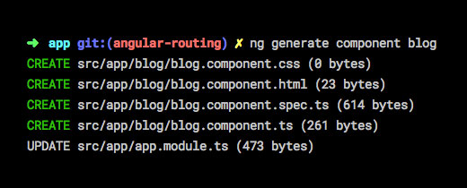
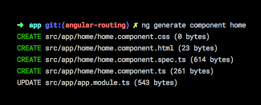
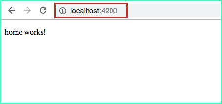
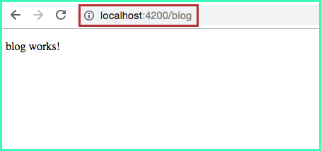
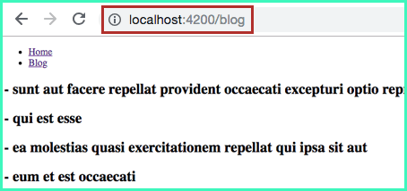
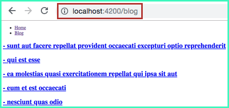
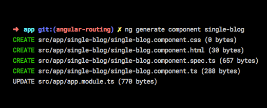
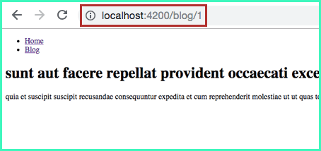

هذا الدرس ضمن دورة إطار العمل أنجولار التي بدأناها آنفا، يمكنك الإطلاع على الدروس السابقة من خلال الروابط التالية :

- [مدخل إلى المكونات في إطار العمل أنجولار](https://www.tutomena.com/web-development/javascript/components-angular-framework/)
- [شرح الخدمات (_Services_) في إطار العمل أنجولار](https://www.tutomena.com/web-development/javascript/angular-services/)

---

عندما يكون الهدف إنشاء تطبيق ويب أحادي الصفحة (Single Page Application) فإن إطار العمل **Angular** من دون شك هو أفضل الحلول أمام مطوري الويب لإنجاز المهمة بأقل مجهود.

تتميز [تطبيقات الويب أحادية الصفحة](https://www.tutomena.com/web-development/javascript/what-is-single-page-application/) بإعطاء المستخدمين ذلك الشعور بالسلاسة والسرعة، فالصفحة الواحدة التي تم تحميلها في البداية تظل في الواجهة طيلة مدة الجلسة، ومحتوى تلك الصفحة - أو جزء منه - يتغير عن طريق عمليات Ajax بدون أن يعاد تحميلها وكأننا في تطبيق سطح مكتب أصلي (Native) ولكن داخل المتصفح :)

تغيير رابط أو محتوى الصفحة ـ الذي هو عبارة عن مجموعة من المكونات ([Components](https://www.tutomena.com/web-development/javascript/components-angular-framework/)) المتشعبة ـ بدون إعادة التحميل (Reload) يتم بفضل واحد من الأجزاء الأساسية المكونة لأنجولار: نظام **Routing**.

في [الدرس السابق عن الخدمات أو Services](https://www.tutomena.com/web-development/javascript/angular-services/)، كنا قد أنجزنا تطبيقات بسيطا للغاية يقوم بجلب عناوين عدد من المقالات من [واجهة برمجية تجريبية](https://jsonplaceholder.typicode.com/) ثم عرض عناوينها في الصفحة الرئيسية.

ما سنفعله في هذا الدرس هو أننا سنقوم بإضافة روابط لتلك العناوين بحيث أن كل عنوان (رابط) يؤدي لصفحة المقال (Single page) لكي نعرض فيها نص المقال كاملا وبعضا من المعلومات الأخرى. وأقترح كذلك أن نقوم بنقل لائحة عناوين المقالات من **app.component.html** إلى صفحة جديدة نسميها مثلا "**المدونة**"، وسننشئ أيضا مكونات جديدا اسمه **Home** ليكون الممثل الجديد للصفحة الرئيسية لتطبيقنا لأن المكون AppComponent سيلعب منذ الآن دور الأب أو ال **Master** لكل المكونات الأخرى في التطبيق، وسنرى جميعا كيف ذلك بالتفصيل مع تقدمنا في هذا الدرس :)

إذن في النهاية سيكون لدينا في تطبيقنا 3 أنماط من الروابط :

```
http://localhost:4200/
http://localhost:4200/blog
http://localhost:4200/blog/{post_id}
```

الرابط الأول كما تلاحظون هو للصفحة الرئيسية، الثاني للمدونة والثالث هو لصفحة المقال، حيث {post_id} هو ال Id الخاص بالمقالة.

سنستخدم ميزة Routing في إطار العمل Angular حتى نستطيع قراءة عنوان الرابط (Url) وعرض الصفحة أو Component الموافق لذلك ال URL.

## إنشاء صفحة المدونة

أولا سنقوم بإنشاء صفحة المدونة التي ستظهر فيها عناوين مقالاتنا.

كما نعرف جميعا، واجهة المستخدم (User Interface) في تطبيقات **أنجولار** تتكون من مجموعة من المكونات (Components) المتداخلة، والصفحة نفسها هي مكون كبير يضم عدد من المكونات الأصغر.

إذن لكي ننشئ صفحة ال Blog علينا أن نقوم بتوليد مكون جديد بنفس الإسم عن طريق Angular CLI بهذه بهذه الطريقة :

```
ng generate component blog
```

هذا الأمر سيقوم بإنشاء مجلد اسمه blog داخل `src/app` ومعه أربع ملفات خاصة بمكون `المدونة`، كما تلاحظون في هذه الصورة :

[](../images/create-blog-component.jpg)

ملف `blog.component.html` هو القالب الخاص بالمكون BlogComponent، ولحد الساعة يضم هذا الكود فقط :

```html
<p>
  blog works!
</p>
```

## إنشاء المكون Home

بنفس الطريقة التي أنشأنا بها المكون BlogComponent سنقوم بإنشاء المكون HomeComponent.

[](../images/create-home-component.png)

إذن، نحن الآن لدينا 3 مكونات في تطبيقنا:

- `AppComponent` : المكون الرئيسي للتطبيق، والذي يتولى لحد الآن مهمة عرض لائحة المقالات.
- `HomeComponent` : المكون الجديد الذي سيمثل صفحتنا الرئيسية.
- `BlogComponent` : المكون الذي أنشأناه للتو والذي لا يقوم بعد بأي عمل يستحق أن نشكره عليه :) ولكن رغم ذلك نريد رؤية تلك الرسالة الظريفة (blog works!) على صفحة خاصة في تطبيقنا، ربما حان الوقت لكي نستعين بقدرات Angular Router.

## إضافة المسارات (Routes)

المسارات أو Routes هي مجموعة من العناوين (URL) التي سيقوم إطار العمل Angular بقراءتها لتحديد المكون أو المكونات الموافقة لذلك المسار لعرضها على الشاشة.

لنقم بإنشاء ملف جديد اسمه `routing.ts` داخل المجلد `/app`، ولنضع بداخله الكود التالي :

```javascript
import { HomeComponent } from './home/home.component';
import { BlogComponent } from './blog/blog.component';

import { Routes } from '@angular/router';

export const appRoutes: Routes = [
  { path: 'blog', component: BlogComponent },
  { path: '', component: HomeComponent }
];
```

قمنا باستيراد المكونات التي أنشأناها سابقا، ثم أنشأنا مصفوفة من نوع **Routes** (يجب استيرادها كذلك)، حيث كل عنصر في المصفوفة عبارة عن كائن جافاسكريبت يضم خاصيتين اثنتين :

- **path**: العنوان أو URL. عندما تكون قيمتها فارغة، فهذا يعني بأن ال Url هو جذر الموقع أو الدومين الذي يؤشر عليه التطبيق (في حالتنا: /http://localhost:4200).
- **component**: المكون الذي نريد عرضه عن طلب ال Url الموجود في الخاصية path.

في الأخير لا ننسى تصدير المصفوفة appRoutes عن طريق export حتى نقوم باستيرادها لاحقا.

نحن الآن قمنا بإنشاء المسارات التي نحتاجها، ولكن لم نخبر بعد التطبيق عن وجودها حتى يأخذها بعين الإعتبار. دعونا لا نضيع مزيدا من الموقت، ولنفتح الملف **app.module.ts** حتى يعلم تطبيقنا أين يجد تلك المسارات وكيف يستخدمها.

> اسم الملف **routing.ts** غير مهم، يمكننا اختيار الإسم الذي يحلو لنا.

### **تسجيل المسارات (routes) في التطبيق**

نحن الآن في الملف app.module.ts، سنقوم باستدعاء المصفوفة **appRoutes** التي قمنا بتصديرها قبل قليل من الملف routing.ts، ولا ننسى كذلك استيراد الوحدة **RouterModule** من angular/router@. بعد ذلك مباشرة سنضيف السطر التالي في المصفوفة imports التي تجدونها في الكائن (Object) الذي تم تمريره كبارامتر للمصمم **NgModule@**.

```javascript
...
import { RouterModule } from '@angular/router';
import appRoutes from './routing';

@NgModule({
declarations: [
...
],
imports: [
...
RouterModule.forRoot(appRoutes)
],
providers: [],
bootstrap: [...]
})
export class AppModule { }
```

مازالت لدينا خطوة واحدة متبقية حتى يعمل نظام Routing في تطبيقنا كما يجب. سنخبر أنجولار عن المكان الذي يجب أن يعرض فيه المكونات التي أنشأناها وأضفناها لنظام ال Routing عن طريق المصفوفة appRoutes، لأن تطبيقنا الآن يعرف عن وجود تلك ال Routes ولكن لا يعرف أن سيقوم بعرضها في واجهة المستخدم.

### **إضافة <router-outlet> إلى قالب المكون الرئيسي لتطبيقنا**

هل تذكرون عندما تحدثنا عن أن القالب `app.component.html` سيلعب منذ الآن دور ال Master بالنسبة لواجهة المستخدم، الآن سنعرف جميعا كيف ذلك.

عندما نقوم بتوليد مشروع Angular بواسطة Angular CLI فإنه يتم إنشاء مكون اسمه **AppComponent** بشكل أوتوماتيكي واعتماده تلقائيا كمكون رئيسي للتطبيق، لذلك يمكنكم ملاحظة بأنه يتم إضافته للمصفوفة **bootstrap** الموجودة داخل NgModule@. هذا يعني بأن Angular يتخذ ذلك المكون كنقطة دخول إلى التطبيق، وهو المكون الذي يتم إضافته إلى الملف index.html ومنه تتفرع باقي مكونات التطبيق.

إذن حالما نفتح الرابط `/http://localhost:4200` فإن أنجولار سيقوم بعرض `app.component.html`، وهو القالب الخاص بالمكون الرئيسي `AppComponent`. من داخل هذا القالب إذن سنقول لأنجولار: اسمع يا أنجولار، هنا ستضع المكون المناسب حالما يكون هناك تغير في عنوان الصفحة (URL).

في الدرس السابق، كنا قد عرضنا لائحة المقالات في القالب **app.component.html** على هذا النحو :

```html
<h2 *ngFor="let post of posts">
  - {{post.title}}
</h2>
```

وكما قلنا سابقا لائحة المقالات سننقلها إلى المكون BlogComponent، ولذلك سنمسح هذا الكود (نضعه جانبا في مكان آمن سنحتاجه فيما بعد) المسؤول عن عرض عناوين المقالات من الملف app.component.html ونقوم بتعويضه بما يلي :

```html
<router-outlet></router-outlet>
```

عن طريق هذا السطر يعلم أنجولار أين سيقوم بإضافة وعرض ال Components الداخلة في نظام Routing :)

الآن عندما نقوم بتغيير عنوان ال URL بشكل يدوي فإن أنجولار سيقوم بعرض المكون الموافق لذلك الرابط. لاحظوا الصورتين :

[](../images/home-page.png)

[](../images/blog-page.png)

رائع أليس كذلك :)

رغم هذا مازال هناك نقص في تطبيقنا، هل سنطلب من المستخدمين أن يقوموا بإدخال الرابط يدويا في شريط العنوان بالمتصفح ؟ بالتأكيد لا. يجب أن نوفر لهم قائمة (Menu) يستطيعون من خلالها التجول في التطبيق بسهولة.

## إنشاء قائمة رئيسية (Navigation bar)

لكي نتمكن من الوصول إلى صفحة Blog يجب أن نقوم بإضافة قائمة رئيسية إلى تطبيقنا تضم رابطين اثنين: واحد للمدونة والآخر للصفحة الرئيسية (Home) حتى نتمكن من العودة إليها عندما نكون في المدونة.

كيف ذلك ؟

أحسنت :) عن طريق الملف `app.component.html`.

سنفتح هذا الملف ونضيف إلى أعلاه كود HTML الخاص بالقائمة الرئيسية.

لنضع شيئا بسيطا، فقط رابطين بداخل <ul> مثلا.

```html
<ul>
  <li>
    <a href="/">Home</a>
  </li>
  <li>
    <a href="/blog">Blog</a>
  </li>
</ul>

<router-outlet></router-outlet>
```

الرابط الأول يؤدي إلى الصفحة الرئيسية (Home) والثاني إلى صفحة المدونة (Blog)، والمحتوى يتغير بشكل عادي، قد نفهم منه أن كل شيء على ما يرام ولكن الحقيقة غير ذلك! :(

تلاحظون أنه عند النقر على أحد الرابطين يعاد تحميل الصفحة في المتصفح، وكأننا ندخل إلى ذلك الرابط يدويا وبطريقة مباشرة تماما كما فعلنا قبل قليل عندما كنا نغير ال URL بشكل يدوي. في الحقيقة هذا هو السلوك العادي لأي رابط في لغة HTML، ولكن المشكل أنه عندما يعاد تحميل الصفحة فإننا نفقد حالة التطبيق (State) بشكل كامل، وهذا أمر عادي لأن جميع المتغيرات والعمليات في جافاسكريبت يقضى عليها وتنتهي حياتها عندما نغادر الصفحة، وهو بالفعل ما نفعله الآن. نحن بحاجة لنظام الصفحة الواحدة (Single Page) - الذي صمم أنجولار في الأصل من أجله - حتى نظل محافظين على State عند الإنتقال من صفحة لأخرى (من مكون لآخر).

ليس علينا أن نقلق كثيرا، فحل هذه المشكلة بسيط للغاية :)

في الرابطين الذين يؤديان لصفحتي Home و Blog سنقوم بتعويض href بِ **routerLink**، بهذا سيعلم Angular أنه عليه منع السلوك الإفتراضي للوسم <a> وبذلك الحفاظ على مبدأ تطبيق الصفحة الواحدة (SPA) الذي صُمم كل هذا من أجله.

```html
<ul>
  <li>
    <a routerLink="/">Home</a>
  </li>
  <li>
    <a routerLink="/blog">Blog</a>
  </li>
</ul>

<router-outlet></router-outlet>
```

الآن تطبيقنا أحادي الصفحة يعمل كما يجب، تلاحظون أن المنطقة التي تتغير هي فقط حيث وضعنا <router-outlet>، بينما القائمة الرئيسية لا يشملها أي تغيير وتظل باقية في الصفحة مهما تغير ال URL. وهكذا نفعل مع كل العناصر المشتركة بين جميع الصفحات مثل الشريط الجانبي (Sidebar) وال Footer إلخ...

### **نقل قائمة المقالات إلى صفحة Blog**

أظن الآن بأن الأوان قد حان لجعل عناوين المقالات تظهر في صفحة المدونة عوضا عن رسالة _!blog works_ :)

الكود الذي مسحناه سابقا من ملف app.component.html والذي طلبت منكم وضعه في مكان آمن لأننا سنحتاجه فيما بعد، سنقوم بنسخه ولصقه في القالب `blog.component.html` :

```html
<h2 *ngFor="let post of posts">
  - {{post.title}}
</h2>
```

لكي يعمل هذا القالب، يجب ألا ننسى نقل الأكواد المسؤولة عن جلب المقالات من الخدمة PostService التي أعددناها في الدرس الفائت. هذا الأكواد مازالت موجودة في الوقت الحالي داخل كلاس المكون AppComponent، يجب قصها من هنالك ولصقها داخل الكلاس **BlogComponent** المسؤول عن تزويد القالب **blog.component.html** بالبيانات التي يحتاجها (الكائن **posts**).

إذا تم كل شيء على ما يرام فإن الملف **blog.component.ts** سيكون على هذا الشكل :

```javascript
import { Component, OnInit } from '@angular/core';
import { PostService } from '../services/post.service';

@Component({
selector: 'app-blog',
templateUrl: './blog.component.html',
styleUrls: ['./blog.component.css']
})
export class BlogComponent implements OnInit {

public posts: any;

constructor (private postService: PostService) { }

ngOnInit() {
this.getPosts();
}

    getPosts(){
    	this.postService.fetchPosts().subscribe(data => {

    		this.posts = data;

    	});
    }

}

```

بينما ملف `app.component.ts` سيعود لحالته البدئية :

```javascript
import { Component, OnInit } from '@angular/core';

@Component({
  selector: 'app-root',
  templateUrl: './app.component.html',
  styleUrls: ['./app.component.css']
})
export class AppComponent implements OnInit {
  constructor() {}

  ngOnInit() {}
}
```

[](../images/blog-page-2.png)

الآن لنقم بإضافة روابط لهذه العناوين، كل عنوان سيؤدي لصفحة Single الخاصة بذلك المقال.

في القالب **blog.component.html** لدينا المصفوفة **posts** التي تضم مجموع المقالات التي يضم عرضها. لحد الساعة نعرض العنوان فقط `{{post.title}}` داخل الحلقة `*ngFor`، ولكن يمكننا كذلك الوصول إلى المحدد `id` الخاص بالمقال حتى نستخدمه في عنوان URL الخاص بكل مقال لكي نتمكن من الولوج لصفحة Single واستغلال ذلك المحدد لجلب عدد من البيانات التي تخص تلك المقالة من قاعدة البيانات (الواجهة البرمجة API).

قائمة المقالات سيصبح قالبها على النحو الآتي :

```html
<h2 *ngFor="let post of posts">
  <a routerLink="/blog/{{post.id}}">
    - {{post.title}}
  </a>
</h2>
```

تلاحظون أننا أحطنا العنوان برابط `<a>` يؤدي للعنوان `/blog/{{post.id}}` ، حيث `{{post.id}}` هو المحدد الخاص بكل مقالة.

على سبيل المثال المقالة التي محددها 1 سيكون رابطها هو :

```
http://localhost:4200/blog/1
```

[](../images/blog-page-3.png)

## إنشاء صفحة Single

الآن وبعد أن جعلنا الروابط تؤدي لصفحة المقال، يجب علينا إنشاء هذه الصفحة، لأنه في الوقت الحالي عندما ننقر على أحد الروابط سنحصل على خطأ من Angular لأن الأخير يحاول البحث عن مكون يستجيب لنمط ال URL الجديد (_blog/1/_) فلا يجده، لأننا ـ كما تذكرون ـ أضفنا فقط نمطين في ملف `routing.ts`: نمط خاص بالصفحة الرئيسية وآخر يخص المدونة. يجب علينا إضافة نمط ثالث يمثل صفحة أو مكون المقالة، ولكن قبل ذلك يجب إنشاء ذلك المكون. سنقوم بتوليده بالإعتماد على Angular CLI تماما كما فعلنا مع مكوني Blog و Home.

لنسميه مثلا `single-blog` :

[](../images/generate-single-blog.png)

الآن يمكننا الذهاب إلى ملف `routing.ts` وإضافة مسار آخر خاص بمكوننا الجديد.

```javascript
import { HomeComponent } from './home/home.component';
import { BlogComponent } from './blog/blog.component';
import { SingleBlogComponent } from './single-blog/single-blog.component';

import { Routes } from '@angular/router';

export const appRoutes: Routes = [
  { path: 'blog', component: BlogComponent },
  { path: 'blog/:id', component: SingleBlogComponent },
  { path: '', component: HomeComponent }
];
```

أضفنا النمط الجديد `blog/:id` الذي يستدعي المكون `SingleBlogComponent` الذي أنشأناه للتو، والرمز `id:` يعني بأنه بارامتر نستطيع الحصول على قيمته من داخل المكون.

النقطتان `:` قبل اسم البارامتر ضروريتان.

الآن عند النقر على أي من روابط المقالات سنحصل على الرسالة الإفتراضية.

```
single-blog works!
```

يجب علينا جعل المحتوى ديناميكيا عن طريق استعمال البارامتر id لجلب بيانات المقالات من ال API.

### **تعديل الخدمة PostService**

لحد الساعة، عندنا method واحدة فقط `fetchPosts` داخل الكلاس `PostService` تجلب المقالات من ال API وإرجاعها على شكل كائن جافاسكريبت من نوع `Observable`.

نريد إضافة method أخرى نمرر لها البارامتر `id` وتقوم بجلب المقال المناسب بناء على هذا البارامتر.

سنسمي هذه الدالة مثلا `fetchPostById` :)

```javascript
fetchPostById(id: number){
return this.HttpClient.get("https://jsonplaceholder.typicode.com/posts/"+ id);
}
```

الدالة `()fetchPostById` إذا مررنا لها مثلا البارامتر 1 ستقوم بقراءة وجلب البيانات من الرابط :

```
https://jsonplaceholder.typicode.com/posts/1
```

### **الإستعانة بالخدمة PostService في المكون SingleBlogComponent**

كما فعلنا في المكون `BlogComponent`، سنقوم بحقن الخدمة نسخة من `PostService` في البناء `Constructor` الخاص بالمكون `SingleBlogComponent`، ثم نقوم باستعمال تلك الخدمة في دالة جديدة نقوم بإنشائها ونمرر لها البارامتر `id` الذي نأخذه من `URL`، وليكن اسمها على سبيل المثال `()getPost`. في الأخير سنقوم باستدعاء هذه الدالة في `ngOnInit`.

قبل أن نكتشف معا كيف نقوم باستخلاص البارامتر من عنوان `URL`، سنرى كيف هو شكل الكلاس `SingleBlogComponent` :

```javascript
import { Component, OnInit } from '@angular/core';
import { PostService } from '../services/post.service';

@Component({
selector: 'app-single-blog',
templateUrl: './single-blog.component.html',
styleUrls: ['./single-blog.component.css']
})
export class SingleBlogComponent implements OnInit {

public post: any;

constructor (private postService: PostService) { }

ngOnInit() {
let id = 1;
this.getPost(id).subscribe(data => {
this.post = data;
});;
}

    getPost(id: number){
    	return this.postService.fetchPostById(id);
    }

}
```

تلاحظون أننا مررنا العدد 1 كبارامتر مؤقت للدالة `(1)getPost`، ولكن بعد قليل سنقوم بتعويضه بالبارامتر الموجود في `URL`.

الكائن `this.post` ستكون بنيته على الشكل التالي :

```json
{
  "userId": 1,
  "id": 1,
  "title": "sunt aut facere repellat provident occaecati excepturi optio reprehenderit",
  "body": "quia et suscipit nsuscipit recusandae consequuntur expedita et cum nreprehenderit molestiae ut ut quas totam nnostrum rerum est autem sunt rem eveniet architecto"
}
```

في القالب `single-blog.component.html` يمكننا استخدام الكائن post لعرض ال body الخاص بالمقال أسفل العنوان :

```html
<div *ngIf="post">
  <h1>{{post.title}}</h1>
  <p>
    {{post.body}}
  </p>
</div>
```

بعد إتمام كل هذه التعديلات على ما يرام، سنحصل على صفحة المقالة مع عنوان وجسم المقالة ذات المحدد 1 عند النقر على أحد الروابط :

[](../images/single-blog-page.png)

### **استخلاص البارامتر من عنوان URL**

لم يتبقى لنا الآن سوى أن نقوم بأخذ البارامتر id من الرابط وتمريره بعد ذلك للدالة ()getPost عوض العدد 1، حتى نحصل على صفحة المقال المناسبة عند النقر على كل عنوان من العناوين الموجودة في المدونة.

سنفتح الملف حيث يوجد الكلاس **SingleBlogComponent** ثم :

- نقوم باستيراد الوحدة `ActivatedRoute` من `angular/router@`.
- نحقن خاصية من نوع `ActivatedRoute`  في البَناء الخاص بالكلاس (مثلما فعلنا مع `PostService`).
- في الأخير نقوم باستغلال هذه الخاصية من أجل استخلاص المعامل id من ال Url.

ليكون الشكل النهائي للملف `single-blog.component.ts` هو كالتالي :

```javascript
import { Component, OnInit } from '@angular/core';
import { ActivatedRoute } from '@angular/router';
import { PostService } from '../services/post.service';

@Component({
selector: 'app-single-blog',
templateUrl: './single-blog.component.html',
styleUrls: ['./single-blog.component.css']
})
export class SingleBlogComponent implements OnInit {

public post: any;

constructor (private postService: PostService,
private route:ActivatedRoute) { }

ngOnInit() {
let id = this.route.snapshot.params['id'];
this.getPost(id).subscribe(data => {
this.post = data;
});;
}

    getPost(id: number){
    	return this.postService.fetchPostById(id);
    }

}
```

لاحظوا أننا عوضنا الرقم 1 بقيمة البارامتر الذي حصلنا عليه عن طريق هذا السطر :

```javascript
let id = this.route.snapshot.params['id'];
```

وبهذا تصبح عملية جلب معلومات المقال ديناميكية والمعلومات تختلف باختلاف رابط المقال الذي ننقر عليه.

## النهاية

هكذا تعرفنا خطوة بخطوة على نظام Routing في إطار العمل أنجولار. رأينا كيف نقوم بربط أنماط لمسارات URL بمكونات محددة تلعب دور الصفحات، واكتشفنا كيف نقوم بعرض محتوى ديناميكي في هذه الصفحات بفضل البارامترات التي نستخلصها من عناوين URL بدون عناء كبير. وإذا كان الدرس طويلا نوعا ما فلأني لم أرد حرق أي مرحلة مهما صغرت حتى لا يجد المبتدؤون أدنى مشكل في مسايرة الموضوع.

هناك بعض التفاصيل التي لم يكن بالإمكان التطرق إليها كلها في هذه المقالة، لذلك أدعوكم لزيارة الروابط أسفله للإستزادة والتعمق أكثر في Angular Routing.

بدوري سأكون في انتظار ملاحظاتكم واستفساراتكم في التعليقات، سأسر كثيرا بتفاعلكم :)

---

###مراجع :

- [angular.io](https://angular.io/guide/router)
- [smashingmagazine.com](https://www.smashingmagazine.com/2018/11/a-complete-guide-to-routing-in-angular/)

### رابط Github :

- [Angular Series](https://github.com/tutomena/angular-series/)
