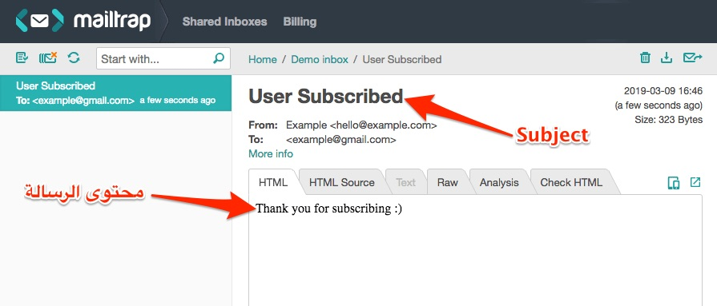
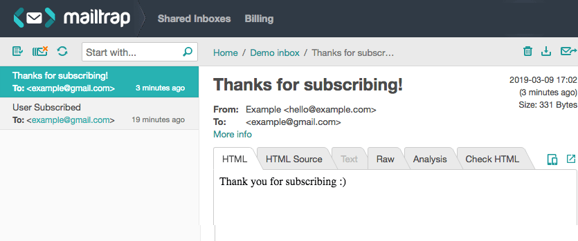

إرسال الإيميل أو البريد الإلكتروني من الوظائف التي نجدها في كل تطبيقات الويب خاصة منها التي تتيح العضوية لمستخدميها، فالبريد الإلكتروني هو أسهل القنوات وأقلها تكلفة التي يمكننا من خلالها التواصل مع المستخدم وإرسال التنبيهات والإشعارات إليه.

في هذا الدرس سنتعلم معا كيفية إرسال الإيميلات باستخدام [إطار العمل لارافيل](https://www.tutomena.com/web-development/php/%d8%a5%d8%b7%d8%a7%d8%b1-%d8%a7%d9%84%d8%b9%d9%85%d9%84-%d9%84%d8%a7%d8%b1%d8%a7%d9%81%d9%8a%d9%84/)، وسنعتمد في ذلك على [خدمة Mailtrap.io](https://mailtrap.io/) التي توفر خادم SMTP مزيف (Fake SMTP) لتمكين المطورين من إرسال الإيميلات والتوصل بها بسرعة في علبة البريد الوهمية الخاصة ب Mailtrap.

## إعداد خادم SMTP

أول خطوة سنقوم بها بطبيعة الحال هي إنشاء مشروع لارافيل من الصفر، وليكن اسمه مثلا laravel-mailable:

```terminal
laravel new laravel-mailable
```

> يجب أولا تثبيت Laravel Installer حتى يعمل لديك الأمر أعلاه. الطريقة والتفاصيل في [هذا الرابط](https://laravel.com/docs/5.8/installation).

Laravel، كغيره من أطر الأخرى الأخرى، يدعم بشكل جيد خدمة Mailtrap. من أجل أن نخبره بأننا نريد استخدامها، سنفتح الملف **env.** ونبحث فيه عن المنطقة الخاصة بإعدادات ال `MAIL_DRIVER` ثم نقوم بنسخ المعلومات الخاصة بحسابنا على **مايل تراب**.

```bash
MAIL_DRIVER=smtp
MAIL_HOST=smtp.mailtrap.io
MAIL_PORT=2525
MAIL_USERNAME=xxxxxxxxxx
MAIL_PASSWORD=zzzzzzzzzz
MAIL_ENCRYPTION=null
```

`MAIL_USERNAME` و`MAIL_PASSWORD` يمكن الحصول عليهما من خلال لوحة التحكم الخاصة بحسابك على Mailtrap.io.

## إنشاء نموذج الإيميل أو Mailable

ظهرت ميزة ال Mailables لأول مرة في [إصدار Laravel 5.3](https://www.tutomena.com/web-development/php/laravel-53-new-features/)، وكان هدفها توفير كلاس أو نموذج خاص لكل نوع من أنواع الإيميلات التي يتم إرسالها في التطبيق. بهذه الطريقة سيمكننا الوصول إلى هذه الكلاسات بسهولة والتعديل عليها كما يحلو لنا دون المساس بباقي النماذج.

في هذا المثال، سنقوم بإنشاء `Mailable` نختار لها الإسم `UserSubscribed`، وذلك من خلال أوامر `php artisan` الخاصة بلارافيل.

```terminal
php artisan make:mail UserSubscribed
```

[alert type="info" icon-size="normal"]من المستحسن دائما تسمية الكلاس باسم يدل على دورها والحالة التي يتم فيها إرسالها. هنا سميناها UserSubscribed لأننا افترضنا بأننا سنقوم بإرسالها لأي مستخدم بعد تسجيله في الموقع.[/alert]

هذا الأمر سيقوم بإنشاء ملف اسمه **UserSubscribed.php** في المجلد app/Mail، هذا الملف يضم الكلاس UserSubscribed الذي يمثل البريد الإلكتروني، وهيئته الإفتراضية على النحو الآتي:

```php
<?php

namespace App\Mail;

use Illuminate\Bus\Queueable;
use Illuminate\Mail\Mailable;
use Illuminate\Queue\SerializesModels;
use Illuminate\Contracts\Queue\ShouldQueue;

class UserSubscribed extends Mailable
{
    use Queueable, SerializesModels;

    /**
     * Create a new message instance.
     *
     * @return void
     */
    public function __construct()
    {
        //
    }

    /**
     * Build the message.
     *
     * @return $this
     */
    public function build()
    {
        return $this->view('view.name');
    }
}
```

ما يهمنا حاليا في هذا الكلاس هو الوظيفة **()build** التي تقوم بإرجاع القالب أو Template الخاص بالبريد الإلكتروني.

هذه الوظيفة تفترض بأن هناك قالب اسمه name.blade.php بداخل المجلد view في المسار resources/views. نحن سنقوم بتغيير هذا المسار إلى شيء أكثر دلالة.

سنسمي القالب الخاص برسالتنا **user_subscribed**.blade.php ليتماشى الإسم مع الموضوع، ونضعه بداخل مجلد اسمه mail في المسار resources/views حيث مجموع قوالب لارافيل.

```php
public function build()
{
    return $this->view('mail.user_subscribed');
}
```

### ملف القالب

لنفتح الآن الملف *user_subscribed.blade.php* ونضع فيه المحتوى الذي نريد إرساله للمستخدم.

```html
<div>
  Thank you for subscribing :)
</div>
```

### الآن حان الوقت لإرسال بريدنا الإلكتروني :)

في الحالات الحقيقية نفعل ذلك انطلاقا من ال Controller داخل وظيفة (Method) معينة. ولكن بما أننا في هذا الدرس يهمنا فقط معرفة كيفية إرسال ال Mailable، فسنقوم بذلك في الملف _routes/web.php_.

الهيئة البدئية بعد إنشاء أي مشروع لارافيل ستكون كالتالي:

```php
Route::get('/', function () {
 return view('welcome');
});
```

هذا الكود يقوم للارافيل، إذا قام المستخدم بزيارة الصفحة الرئيسية فاعرض له الشاشة resources/views/welcome.blade.php.

نحن لن نعرض الشاشة welcome بل فقط سنقوم بإرسال الإيميل ونقوم بإرجاع رسالة تخبرنا بأن الإرسال تم بنجاح :)

```php
use App\Mail\UserSubscribed;
use Illuminate\Support\Facades\Mail;

Route::get('/', function () {
    Mail::to('example@gmail.com')->send(new UserSubscribed);
    return "Email sent";
});
```

استعننا بالكلاس Mail لإرسال الرسالة نحو عنوان البريد الإلكتروني للمستخدم، ونقوم بتمرير محتوى الرسالة عن طريق بارامتر للوظيفة ()send عبارة عن نموذج (_Instance_) من الكلاس UserSubscribed الذي أنشأناه آنفا.

## تشغيل الخادم

لنقم الآن بتشغيل خادم PHP كما يلي:

```terminal
php artisan serve
```

بعد تشغيل الخادم، سندخل إلى الرابط /http://127.0.0.1:8000 إذا تمت جميع الإعدادات والأمور السابقة على ما يرام فإننا سنرى الرسالة "_Email sent_" على الشاشة، وعند تفقد Mailtrap سنجد بأن الإيميل قد وصل بالفعل :)



نلاحظ أن عنوان الرسالة User Subscribed تم توليده آليا من طرف لارافيل بالإعتماد على اسم الكلاس UserSubscribed، وهذا غير مناسب للتطبيقات الحقيقية لأن العنوان يجب أن يكون احترافيا وسليما من الناحية اللغوية. لهذا يسمح لنا لارافيل بتحديد عنوان (Subject) ال Mailable داخل الوظيفة ()build التي رأيناها سابقا.

هكذا الكيفية:

```php
public function build()
{
    return $this->subject('Thanks for subscribing!')->view('mail.user_subscribed');
}
```



## إرسال بيانات ديناميكية

نحن الآن تعلمنا كيف نرسل بريد إلكتروني ولكن من دون بيانات أو معلومات ديناميكية، وفي أحيان كثيرة نحتاج فعلا لأن نمرر عددا من المتغيرات إلى قالب الإيميل مثلما نفعل عادة مع قوالب الصفحات في مشاريع لارافيل.

لنفرض مثلا أننا نريد إضافة اسم المستخدم الذي قام بالتسجيل في الموقع في الرسالة السابقة:

```html
<div>
  Salam Alaykom {{$name}},<br />
  Thank you for subscribing :)
</div>
```

من أين لنا بذلك الإسم **name\$** ؟

لحسن الحظ، Laravel يسمح لنا بفعل هذا بسهولة ومن دون أي إشكال :)

الإسم سيكون عبارة عن خاصية عامة (_public property_) في الكلاس UserSubscribed، ومن خلال ال Constructor الخاص بهذا الكلاس سنقوم بتمرير الإسم على شكل بارامتر عند الإرسال عوض إرسال Instance بدون بارامتر كما فعلنا في السابق.

هكذا سيكون شكل الكلاس:

```php
...

class UserSubscribed extends Mailable
{
...

    public $name;

    public function __construct($name)
    {
        $this->name = $name;
    }

    ...

}
```

وهكذا سنقوم بتمرير الإسم عند الإرسال:

```php
Mail::to('example@gmail.com')->send(new UserSubscribed("Aissa"));
```

تلاحظون أننا مررنا الإسم Aissa بشكل حرفي، بينما في الحالة الحقيقية سنقوم بتمرير شيئا من هذا القبيل user()->name. ما يهمنا هنا هو إيصال الفكرة فقط :)


## في الختام

هكذا نكون قد مررنا على أهم ما يجب معرفته عن **إرسال الإيميلات والتعامل معها في إطار العمل لارافيل**. هناك تفاصيل أخرى ومميزات إضافية لميزة Mailables في هذا الفريموورك الجميل يمكنكم اكتشافها جميعا والتعرف عليها من خلال [زيارة هذا الرابط](https://laravel.com/docs/5.8/mail).

**إذا كانت لديك أسئلة أو استفسارات حول الموضوع فلا تتردد في طرحها في صندوق التعليقات.**

> لا داعي كذلك أن أذكرك بأنه يمكنك نشر الموضوع ـ إذا أعجبك ـ ومشاركته في مختلف منصات التواصل مع أصدقائك المطورين :)
