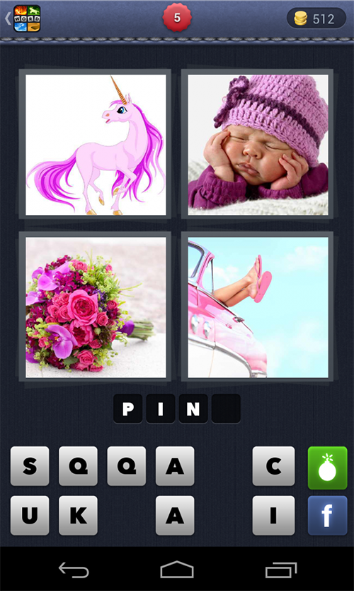
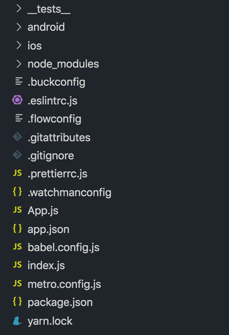
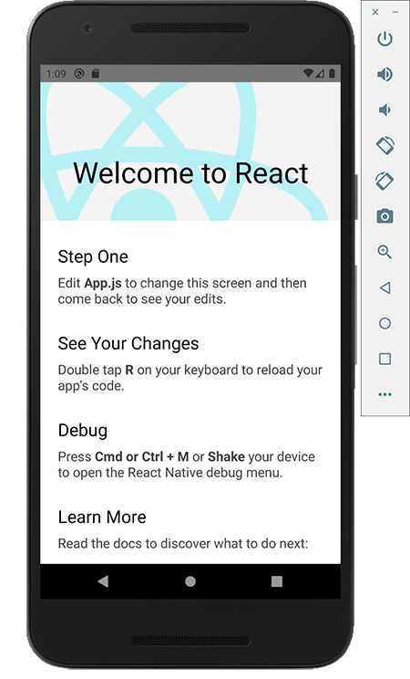
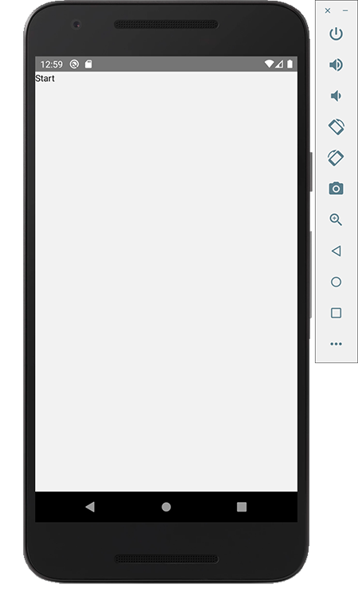
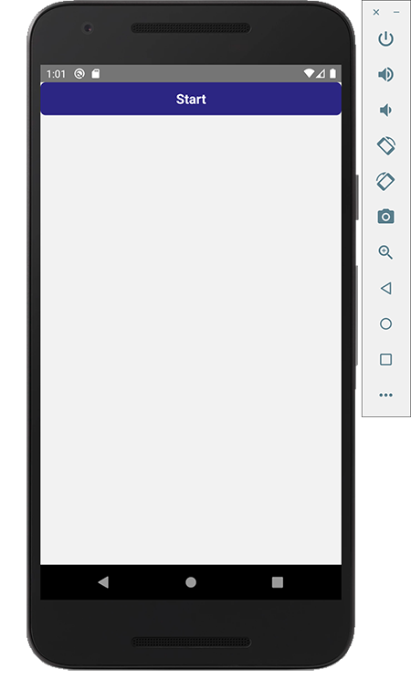
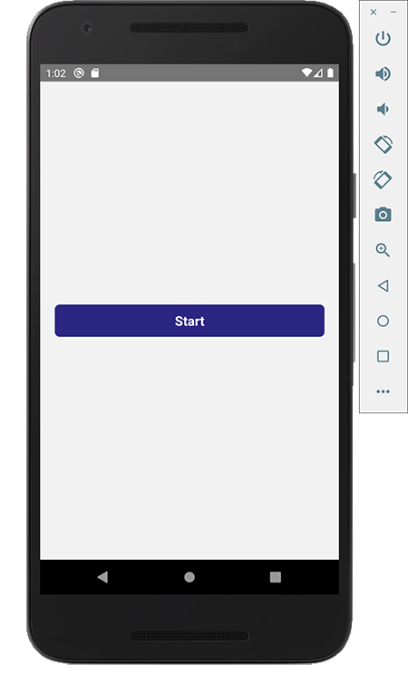
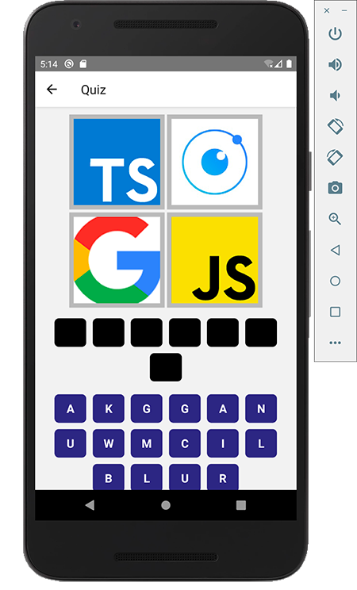
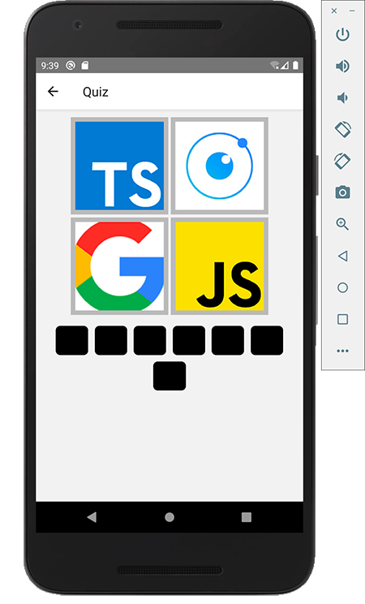
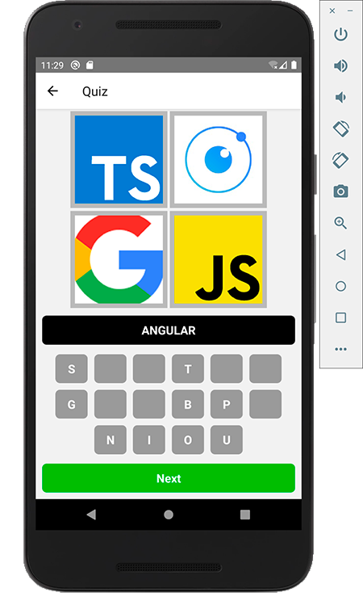

تكلمنا سابقا في عدة مقالات عن إطار العمل **React Native** وتحدثنا بشكل نظري عن إمكانياته وكونه واحد من الحلول الرئيسية لكل من يرغب في بناء تطبيقات الهواتف الذكية باستخدام [جافا سكريبت](/what-is-javascript/).

تدوينة اليوم ستكون عملية أكثر بحيث سنتعلم معا كيفية إنشاء تطبيق موبايل من الصفر باستخدام [رياكت ناتيف](/web-development/javascript/مقدمة-عن-react-native/). والتطبيق الذي وقع عليه اختياري هو تطبيق **أربع صور كلمة واحدة** المعروف.



هذا النوع من التطبيقات الترفيهية اشتهر بشكل كبير جدا في قبل عامين أو ثلاثة في متجري بلاي ستور وآبل ستور، وبالتالي سيكون من الجيد إذا تعلمنا معا كيفية بنائه من الصفر وبالجافا سكريبت فقط 👍

<blockquote class="warning">
    <p>
    سندخل مباشرة في صلب الموضوع ولن أتطرق إلى طريقة تهيئة بيئة العمل. إذا كنت تريد معلومات ومساعدة بهذا الخصوص فعليك <a href="https://facebook.github.io/react-native/docs/getting-started" target="_blank">بزيارة الرابط التالي</a>.
    </p>
    <p>
     قم باختيار البيئة التي تريد استهدافها (أندرويد أو iOS) ثم نظام تشغيلك (ماك، ويندوز أو لينوكس) وبعدها اتبع المراحل المشروحة بشكل واضح.
    </p>

</blockquote>

<blockquote class="success">
    <p>
    يمكنك كذلك العمل بطريقة <strong>Expo</strong> المدعومة كذلك بشكل رسمي من طرف React Native. هذه الطريقة لن تتطلب منك تهيئة شيئ في بيئة عملك باستثناء تثبيت حزمة Expo-Cli في حاسوبك وتطبيق Expo في هاتفك الذكي من أجل رؤية النتائج. هذه الطريقة من أجل البدء بسرعة ولكنها تضيف طبقة تبسيطية حول React Native، وأنا في هذا الدرس أريد أن نشتغل ب <strong>رياكت ناتيف</strong> فقط بدون أي إضافات غير ضرورية 😃
    </p>

</blockquote>

## إنشاء المشروع

سنبدأ مباشرة بإنشاء المشروع من خلال نافذة الأوامر السطرية:

```
npx react-native init FourPicsOneWord
```

ننتظر لبعض الثواني أو الدقائق لحين تهيئة المشروع، ثم نقوم بالدخول للمجلد `FourPicsOneWord`

```
cd FourPicsOneWord
```

الآن ونحن داخل المجلد `FourPicsOneWords` من المفترض أن تكون لدينا مجموعة من الملفات والمجلدات الفرعية على هذه الشاكلة:



دعونا الآن نشغل التطبيق على محاكي الأندرويد الذي سبق لي تثبيته على جهازي انطلاقا من أندرويد ستوديو 🤖

```
npm run android
```

هذا الأمر سيقوم بفتح Android Emulator وتثبيت التطبيق الإفتراضي عليه. إذا كنت تنوي استهداف أجهزة iOS فعليك تنفيذ `npm run ios` عوض `npm run android`.

<blockquote class="warning">
    <p>
      إذا واجهك مشكل SDK location not found في هذه المرحلة، فالحل هو أن تقوم بإنشاء ملف اسمه <code>local.properties</code> داخل المجلد <code>android</code> ثم تضيف إليه المسار الذي يوجد فيه SDK الخاص بأندرويد في جهازك. بالنسبة لي المسار هو التالي:
      </p>
    <p>
      <pre class="language-text">
        <code class="language-text">
          sdk.dir = /Users/aissa/Library/Android/sdk
        </code>
      </pre>
    </p>

</blockquote>

إذا سارت معك الأمور كلها على ما يرام فالمفروض أن يفتح التطبيق بنجاح على المحاكي ويكون لديك شيء شبيه بهذه الصورة:



محتوى هذه الشاشة نجده كاملا في الملف `App.js` حيث المكون `<App />`. سنقوم بإزالة كل محتوى هذا الملف ونعوضه بما يلي:

```jsx
import React from 'react';
import { Text } from 'react-native';

const App = () => <Text>Hello World</Text>;

export default App;
```

بمجرد حفظ الملف ستلاحظون أن مضمون الشاشة قد تغير تلقائيا، فأصبحت لدينا رسالة Hello World في الأعلى.

ولكننا حياة هذه الجملة الصغيرة ستكون قصيرة جدا، حيث أننا سنقوم من جديد بإزالتها وتعويضها بزر. هذا الزر عند الضغط عليه سيقوم بتوجيهنا نحو السؤال الأول من **اختبار أربع صور كلمة واحدة**، ولكن سلوك التوجيه سندعه لوقت لاحق في هذا الدرس. الآن دعونا فقط نقوم بإضافة الزر.

## إضافة زر البدء

لإضافة الأزرار في مشروعنا فإننا نستعمل مكون اسمه `TouchableOpacity` يوفره لنا إطار العمل **React Native** لهذا الغرض بالتحديد.

سنقوم باستعمال هذا المكون لكي نقوم بإضافة زر البدء إلى الشاشة الرئيسية.

```jsx
import React from 'react';
import { Text, TouchableOpacity } from 'react-native';

const App = () => (
  <TouchableOpacity>
    <Text>Start</Text>
  </TouchableOpacity>
);

export default App;
```

تلاحظون أننا قمنا أولا باستيراد المكون `<TouchableOpacity>` من مكتبة `react-native` وقمنا بإحاطة النص "**Start**" بالمكون `<Text>` كما هو مفروض في React Native.



ألا ترون معي بأن شكل الزر بسيط أكثر من اللازم وغير جميل؟ ولا يوحي أصلا بأنه زر بل مجرد نص لا نعرف إن كان علينا النقر عليه أو لا! 😠

الحل في هذه الحالة هو أن نقوم بإنشاء زر مخصص ونقوم بتصميمه والتحكم فيه كما نشاء 🙂

<blockquote class="success">
    <p>
    هناك مكتبات طرف ثالث مثل <strong>nativeBase</strong> توفر لنا عددا كبيرا من المكونات الجاهزة لاستخدامها بسهولة في مشاريع React Native ولكننا في مشروعنا البسيط لن نحتاج إليها، كما أن غرضنا أساسا هنا هو التعلم وبالتالي لا بأس في أن نقوم بإنشاء بعض من هذه المكونات من الصفر.
    </p>
</blockquote>

### إنشاء زر مخصص في رياكت ناتيف

لهذا الغرض سنبدأ بإنشاء مجلد جديد نقوم بتسميته `src` وبداخله مجلد آخر نسميه `elements`. بداخل `elements` ننشئ ملفا اسمه `Button.js` سيحتوي على المكون الذي يمثل زرنا المخصص.

```
src/elements/Button.js
```

المكون `Button` سيكون على هذا الشكل:

```jsx
import React from 'react';

import { StyleSheet, TouchableOpacity, Text } from 'react-native';

const style = StyleSheet.create({
  button: {
    alignItems: 'center',
    justifyContent: 'center',
    borderRadius: 7,
    padding: 10
  },
  text: {
    fontSize: 18,
    fontFamily: 'Almarai-Bold',
    fontWeight: 'bold'
  }
});

export default function({
  bgColor = '#2a2a7e',
  textColor = '#fff',
  onPress,
  disabled,
  children
}) {
  return (
    <TouchableOpacity
      activeOpacity={disabled ? 1 : 0.8}
      style={{
        ...style.button,
        backgroundColor: disabled ? '#9a9a9a' : bgColor
      }}
      onPress={!disabled ? onPress : null}
    >
      <Text style={{ ...style.text, color: textColor }}>{children}</Text>
    </TouchableOpacity>
  );
}
```

نرى بأنه يقبل 5 خصائص لكي نتمكن من التحكم فيه بشكل جيد:

1. **bgColor**: من أجل التحكم في لون خلفية الزر وأعطينا هذه الخاصية اللون `#2a2a7e` كقيمة افتراضية.
2. **textColor**: تمثل هذه الخاصية لون النص في الزر وجعلنا مبدئيا باللون الأبيض.
3. **onPress**: هذه الخاصية يستخدمها المكون `TouchableOpacity` للتنصت على حدث النقر أو الضغط (شبيهة ب `onClick` في تطبيقات الويب).
4. **disabled**: تسمح لنا هذه الخاصية بتعطيل الزر عندما تدعو الحاجة لذلك. في حالة كانت قيمتها تساوي `true` فإن الزر يكون معطلا وبالتالي لا يعمل الحدث `onPress`. استعملنا كذلك هذه الخاصية للتحكم في لون الزر، فإذا كان معطلا فإن لونه يكون رماديا `#9a9a9a` بينما يتخذ اللون `bgColor` فيما عدا ذلك.
5. **children**: هذه الخاصية كما معروف في React.js يتم تمريرها **ضمنيا** لجميع المكونات، وهي المحتوى الذي يكون بين وسمي المكون. في حالتنا هذه `children` هي النص الذي يظهر في الزر.

استعننا أيضا في داخل المكون بالخاصية `activeOpacity` التي تمكننا من التحكم في درجة شفافية الزر عند الضغط عليه. في حالتنا طلبنا منه أن يكون شفافا بدرجة `0.8` لكي يعطي شعورا للمستخدم بأنه فعلا قام بالضغط على الزر، إلا إذا كان هذا الزر معطلا فإن الشفافية تكون قيمتها `1` أي منعدمة، حتى نعطي انطباعا بأن الزر لا يستجيب للمستخدم.

باقي الشفرة المصدرية أظن أنها واضحة بما فيه الكفاية، فقط قمنا بإضافة بعض التنسيقات باستعمال الكائن `StyleSheet` الذي يوفره لنا **React Native**.

الآن إذا طبقت كل الخطوات السابقة كما يجب وقمت بتعويط المكون `Text` بمكوننا `Button` في الملف App.js، سيظهر لديك الزر بشكل أفضل:

```jsx
import React from 'react';

import Button from './src/elements/Button';

const App = () => <Button>Start</Button>;

export default App;
```



سنحاول الآن وضع الزر في وسط الشاشة عوض تركه مركونا في الأعلى بهذا الشكل الذي يدعو للشفقة 😆

لفعل ذلك سنفتح الملف `App.js` ونغيره كما يلي:

```jsx
import React from 'react';
import { View, StyleSheet } from 'react-native';

import Button from './src/elements/Button';

const style = StyleSheet.create({
  container: {
    justifyContent: 'center',
    flex: 1,
    padding: 20
  }
});

const App = () => (
  <View style={style.container}>
    <Button>Start</Button>
  </View>
);

export default App;
```

فقط قمنا بإحاطة الزر بالعنصر `View` وطلبنا من الأخير أن يأخذ كامل المساحة المتوفرة في الشاشة عن طريق الخاصية `flex: 1`، وعملية التوسيط العمودي لمحتوى `View` تمت بفضل الخاصية `justifyContent: 'center'`.



> قبل استعمال أي مكون أو عنصر من عناصر رياكت ناتيف يجب أولا **استيراده** من مكتبة **react-native** وإلا فلن يتم التعرف عليه.

الآن عند النقر على الزر "Start" نريد أن يتم توجيهنا إلى شاشة الإختبار الأولى.

لتسهيل هذه المهمة سنستعين بمكتبة رائعة يوفرها مجتمع [React Native](/tags/react-native/) لتمكيننا من التنقل من شاشة لأخرى وتمرير البيانات فيما بينها بيسر وسهولة. هذه المكتبة اسمها [react-navigation](https://reactnavigation.org/) ويمكنا مقارنتها بمكتبة **react-router** المعروفة بشكل واسع في بيئة الويب و [React.js](/web-development/javascript/react-javascript-library/).

## إضافة react-navigation

سنقوم أولا بتثبيت المكتبة **react-navigation** عن طريق مدير الحزم **npm**:

```
npm install react-navigation
```

بعدها يجب علينا تثبيت أربع مكتبات إضافية تعتمد عليهما حزمة react-navigation في إتمام عملها:

```
npm install react-native-gesture-handler
```

```
npm install react-navigation-stack
```

```
npm install react-native-safe-area-context
```

```
npm install @react-native-community/masked-view
```

إدخال `react-navigation` سيحتم علينا إجراء بعض التغييرات في بنية المشروع الموجودة لدينا حاليا.

أولا علينا نقل محتوى الشاشة الرئيسية من الملف `App.js` إلى ملف خاص نسميه مثلا `HomeScreen.js` ونضعه بداخل مجلد جديد اسمه `screens` (ليس ضروريا أن يكون اسمه screens 😃). هذا المجلد سيكون داخل `src` جنبا إلى جنب مع `elements`.

<div class="filename">src/screens/HomeScreen.js</div>

```jsx
import React from 'react';
import { View, StyleSheet } from 'react-native';

import Button from '../elements/Button';

const style = StyleSheet.create({
  container: {
    justifyContent: 'center',
    flex: 1,
    padding: 20
  }
});

const HomeScreen = () => (
  <View style={style.container}>
    <Button>Start</Button>
  </View>
);

export default HomeScreen;
```

أما الملف `App.js` فهو حاليا فارغ، وسنجري عليه تغييرا شاملا لأن فيه سنقوم بإعداد `react-navigation` وإضافتها للمشروع.

### شرح كيفية إعداد react-navigation

أولا سنقوم باستيراد مكتبة React كما هو معتاد، ثم سنقوم باستيراد شاشتنا الوحيدة لحد الساعة وهي المكون HomeScreen.

<div class="filename">App.js</div>

```js
import React from 'react';

import HomeScreen from './src/screens/HomeScreen';
```

بعد ذلك مباشر سنقوم باستيراد الوظيفة `createStackNavigator` من المكتبة `react-navigation-stack`.

<div class="filename">App.js</div>

```js{3}
import React from 'react';

import { createStackNavigator } from 'react-navigation-stack';

import HomeScreen from './src/screens/HomeScreen';
```

عن طريق هذه الوظيفة سنقوم بتعيين الشاشات المتواجدة في تطبيقنا والتي نريد أن نتنقل فيما بينها.

<div class="filename">App.js</div>

```js{7-19}
import React from 'react';

import { createStackNavigator } from 'react-navigation-stack';

import HomeScreen from './src/screens/HomeScreen';

const AppNavigator = createStackNavigator(
  {
    Home: {
      screen: HomeScreen,
      navigationOptions: () => ({
        headerShown: false
      })
    }
  },
  {
    initialRouteName: 'Home'
  }
);
```

أظن أن البارامترات والخاصيات هنا واضحة ومعبرة كفاية. `initialRouteName` تعني بأن الشاشة `Home` الممثلة بالمكون `HomeScreen` هي الشاشة الإفتراضية في تطبيقنا. بينما الخاصية `headerShown` كما هو واضح من اسمها تمكننا من التحكم في إظهار أو إخفاء **الترويسة** أو الشريط العلوي في شاشة معينة.

المرحلة الأخيرة من عملية الإعداد هي أن نخبر تطبيقنا بأن يأخذ هذه الشاشات والإعدادات بعين الحسبان وذلك بفضل وظيفة `createAppContainer` الموجودة في مكتبة `react-navigation`.

<div class="filename">App.js</div>

```js{3,23,25,27}
import React from 'react';

import { createAppContainer } from 'react-navigation';

import { createStackNavigator } from 'react-navigation-stack';

import HomeScreen from './src/screens/HomeScreen';

const AppNavigator = createStackNavigator(
  {
    Home: {
      screen: HomeScreen,
      navigationOptions: () => ({
        headerShown: false
      })
    }
  },
  {
    initialRouteName: 'Home'
  }
);

const AppContainer = createAppContainer(AppNavigator);

const App = () => <AppContainer />;

export default App;
```

إذا طُبقت كل هذه المراحل بنجاح فمن المفترض أن يظل التطبيق يعمل كما يجب. الفرق أننا الآن رتبنا مشروعنا بشكل أفضل وأصبح بإمكاننا إضافة قدر ما نريد من الشاشات والتنقل فيما بينها بكيفية منظمة وواضحة مثلما سنرى بعد لحظات.

## إضافة شاشة قائمة الأسئلة

سنقوم الآن بالتقدم قليلا نحو الأمام وسنضيف شاشة جديدة نعرض فيها قائمة من الأزرار، كل زر يمثل سؤالا من الأسئلة
التي سيكون علينا الإجابة عليها.

ولكن قبل ذلك دعونا نقوم بإضافة أسئلتنا في ملف جافا سكريبت مستقل `questions.js` داخل مجلد نعطيه الإسم `data`.

<div class="filename">src/data/questions.js</div>

```js
export default [
  {
    id: 'da79aa98-eacf-5fc2-bf26-99d763383bbf',
    answer: 'ANGULAR',
    images: ['1', '2', '3', '4']
  },
  ...
];
```

كل سؤال عبارة عن كائن جافا سكريبت بثلاث خاصيات: الخاصية `id`، الجواب الصحيح `answer`، وأخيرا مصفوفة الصور `images` الخاصة بهذا السؤال.

الصور نضعها في مجلد `images` داخل المجلد `data` في نفس مستوى ملف الأسئلة.

### إنشاء المكون `QuestionsListScreen`

الآن سننشى مكون جديد نسميه مثلا `QuestionsListScreen` وسيكون مسؤولا عن شاشة قائمة الأسئلة.

<div class="filename">src/screens/QuestionsListScreen.js</div>

```jsx
import React from 'react';
import { View, StyleSheet, ScrollView } from 'react-native';

import Button from '../elements/Button';

import questions from '../data/questions';

const stylesheet = StyleSheet.create({
  container: {
    padding: 20
  },
  buttonWrapper: {
    marginBottom: 10
  }
});

const QuestionsListScreen = ({ navigation }) => (
  <ScrollView style={stylesheet.container}>
    {questions.map((question, index) => (
      <View style={stylesheet.buttonWrapper} key={question.id}>
        <Button onPress={() => navigation.navigate('Quiz', { id: index })}>
          Question {index + 1}
        </Button>
      </View>
    ))}
  </ScrollView>
);

export default QuestionsListScreen;
```

هذا المكون لا يحتاج لشرح كبير، فقط قمنا باستيراد مصفوفة الأسئلة وعن طريقها عرضنا أزرارا بعدد الأسئلة الموجودة لدينا. كل زر يؤدي لسؤال محدد عن طريق الكائن `navigation` الذي حصلنا عليه من **react-navigation**. هذا الكائن يتم تمريره كخاصية (Prop) **لجميع الشاشات** وبواسطته يمكننا قراءة البارامترات الممررة للشاشة كما سنرى بعد قليل في شاشة `Quiz`.

الآن لا ننسى إضافة الشاشة `QuestionsListScreen` في إعدادات react-navigation الموجودة بالملف `App.js`.

<div class="filename">App.js</div>

```js{19-21}
import React from 'react';

import { createAppContainer } from 'react-navigation';

import { createStackNavigator } from 'react-navigation-stack';

import HomeScreen from './src/screens/HomeScreen';

import QuestionsListScreen from './src/screens/QuestionsListScreen';

const AppNavigator = createStackNavigator(
  {
    Home: {
      screen: HomeScreen,
      navigationOptions: () => ({
        headerShown: false
      })
    },
    QuestionsList: {
      screen: QuestionsListScreen
    }
  },
  {
    initialRouteName: 'Home'
  }
);

const AppContainer = createAppContainer(AppNavigator);

const App = () => <AppContainer />;

export default App;
```

يتبقى لنا الآن التعديل على المكون `HomeScreen` لكي نطلب من الزر **"Start"** أن يقوم بتوجيهنا لشاشة قائمة الأسئلة.

```jsx{3,5}
...

const HomeScreen = ({ navigation }) => (
  <View style={stylesheet.container}>
    <Button onPress={() => navigation.navigate('QuestionsList')}>Start</Button>
  </View>
);

...
```

إذا ألقينا الآن نظرة على المحاكي فسنجد النتيجة في الصورة التالية:


الطريقة التي استخدمناها في عرض الأزرار تعمل حاليا بشكل جيد ومقبولة، ولكن عندما تكون لدينا قوائم طويلة تبدأ آثارها السلبية على مستوى الأداء في الظهور. إطار العمل React Native يضع رهن إشارتنا حلا أفضل لعرض القوائم ومكونا خاصا لمثل هذه الحالة واسمه `FlatList`.

<blockquote class="success">
    <p>
    المكون <code>ScrollView</code> يقوم بعرض جميع الأبناء <strong>دفعة واحدة</strong>، بينما <code>FlatList</code> يقوم بعرضها <strong>تدريجيا</strong> (Lazy) بشكل يحافظ على مستوى جيد من الأداء والسلاسة.
    </p>
</blockquote>

سنقوم بالتعديل على المكون `QuestionsListScreen` من أجل إدخال `FlatList` في عملية عرض الأزرار عوض مكون `ScrollView` المعمول به حاليا.

<div class="filename">src/screens/QuestionsListScreen.js</div>

```js{3,19-31}
import React from 'react';

import { View, StyleSheet, FlatList } from 'react-native';

import Button from '../elements/Button';

import questions from '../data/questions';

const stylesheet = StyleSheet.create({
  container: {
    padding: 20
  },
  button: {
    marginBottom: 10
  }
});

const QuestionsListScreen = ({ navigation }) => (
  <FlatList
    contentContainerStyle={stylesheet.container}
    data={questions}
    renderItem={({ item, index }) => (
      <Button
        style={stylesheet.button}
        onPress={() => navigation.navigate('Quiz', { id: index })}
      >
        Question {index + 1}
      </Button>
    )}
    keyExtractor={item => item.id}
  />
);

export default QuestionsListScreen;
```

بعد هذا التغيير سيظل التطبيق يشتغل كما هو، ولكن هذه المرة بأساس أقوى 😃

> للمزيد من المعلومات حول طريقة عمل المكون `FlatList` أقترح عليكم زيارة [هذا الرابط](https://facebook.github.io/react-native/docs/flatlist).


يمكننا التحكم في عنوان الشاشة بالشريط العلوي من خلال إعدادات react-navigation فالعنوان الحالي QuestionsList كما ترون ليس مناسبا حيث تم استنباطه فقط من الإسم الذي أعطيناه للشاشة في الكود. سنقوم بتغييره إلى **Questions**.

```js{13-15}
...

const AppNavigator = createStackNavigator(
  {
    Home: {
      screen: HomeScreen,
      navigationOptions: () => ({
        headerShown: false
      }),
    },
    QuestionsList: {
      screen: QuestionsListScreen,
      navigationOptions: () => ({
        title: 'Questions'
      }),
    }
  },
  {
    initialRouteName: 'Home',
  },
);

...
```

الآن أصبح عنوان الشاشة **Questions** عوض **QuestionsList**.

<NewsletterForm />

## شاشة سؤال أربع صور كلمة واحدة

حان الوقت لكي نضيف الشاشة الأهم وهي شاشة السؤال حيث تظهر الأربع صور وتحتها مربعات الحروف كما في هذه الصورة:



سنضيف هذه الشاشة إلى المجلد `screens` عبر ملف جديد اسمه `QuizScreen`.

### عرض الصور

بعد إنشاء الملف سنقوم بتعريف المكون بنفس اسم الملف ونبدأ عملنا فيه **بعرض الصور الأربع**.

<div class="filename">src/screens/QuizScreen.js</div>

```jsx
import React from 'react';

import { View, Image, ScrollView, StyleSheet } from 'react-native';

import questions from '../data/questions';

import Images from '../data/images';

const stylesheet = StyleSheet.create({
  container: {
    padding: 10
  },
  image: {
    width: 150,
    height: 150,
    borderWidth: 7,
    borderColor: '#bababa',
    margin: 2
  },
  flex: {
    flexDirection: 'row',
    justifyContent: 'center',
    flexWrap: 'wrap',
    marginBottom: 10
  }
});

const QuizScreen = ({ navigation }) => {
  const paramId = navigation.getParam('id');

  const current = questions[paramId];

  let { id, images, answer } = current;

  return (
    <ScrollView style={stylesheet.container}>
      <View style={stylesheet.flex}>
        {images.map((image, index) => (
          <Image style={stylesheet.image} source={Images[image]} key={index} />
        ))}
      </View>
    </ScrollView>
  );
};

export default QuizScreen;
```

بدأنا بجلب المكونات التي نحتاج إليها من مكتبة `react-native` ومن بينها مكون `Image` الذي سيسمح لنا بعرض الصور.

جلبنا كذلك مصفوفة الأسئلة من الملف `questions.js` وكائن اسمه `Images` قمنا باستيراده من الملف `images.js` الذي سنقوم بإنشائه داخل المجلد `data` مباشرة، وهذا محتواه:

<div class="filename">src/data/images.js</div>

```js
const Images = {
  '1': require(`./images/1.png`),
  '2': require(`./images/2.png`),
  '3': require(`./images/3.png`),
  '4': require(`./images/4.png`)
};

export default Images;
```

مفاتيح خاصيات هذا الكائن يجب أن تكون هي نفسها أسماء الصور الموجودة في المجلد `images` وفي مصفوفة الصور الموجودة في ملف الأسئلة `questions.js`.

داخل المكون نحصل على البارامتر `id` باستعمال الوظيفة `navigation.getParam(id)` التي كما قلنا يوفرها لنا react-navigation. واسم البارامتر `id` هنا هو نفس الإسم الذي قمنا بتمريره لشاشة الإختبار من خلال أزرار شاشة `QuestionsListScreem` إذا كنتم تتذكرون 🙂

من خلال البارامتر `id` نعرف السؤال الذي سنقوم بعرضه في الشاشة من بين الأسئلة التي قمنا باستيرادها.

السؤال الحالي هنا ممثل بالمتغير `current` وباستعمال تقنية **Object Destructuring** نستخرج منه كل من `id`، `answer` و `images`، وما يهمنا في الوقت الحالي هو المتغير `images` الذي يمثل مصفوفة الصورة الأربعة الخاصية بالسؤال الحالي والتي قمنا بعرضها بواسطة المكون `Image` وبمساعدة الكائن `Images` الذي تحدثنا عنه وشرحنا بنيته قبل قليل.

السبب الذي جعلني أستعين بالكائن `Images` هو أنني عندما أقوم بعمل `require` للصورة مباشرة من داخل المكون فإن React Native يعتبره خطأ ولست أدري ما السبب حقيقة.

فعلى سبيل المثال الكود التالي لا يعمل إلا إذا قمنا بتعيين اسم الصورة مباشرة وليس عن طريق متغير. أتمنى أن كلامي واضح 😅

```jsx
images.map((image, index) => (
  <Image
    style={stylesheet.image}
    // لا يعمل!!
    source={require(`../data/images/${image}.png`)}
    key={index}
  />
));
```

لذلك ارتأيت أن أقوم بعمل `require` للصور في ملف منفصل بشكل ستاتيكي واستيراده بعد ذلك.

### عرض مربعات الجواب (المربعات السوداء)

```jsx{42,45,47,55,57-61,71-79,81-85}
import React from 'react';

import { View, Image, ScrollView, StyleSheet, Text } from 'react-native';

import Button from '../elements/Button';

import questions from '../data/questions';

import Images from '../data/images';

const stylesheet = StyleSheet.create({
  container: {
    padding: 10
  },
  image: {
    width: 150,
    height: 150,
    borderWidth: 7,
    borderColor: '#bababa',
    margin: 2
  },
  flex: {
    flexDirection: 'row',
    justifyContent: 'center',
    flexWrap: 'wrap',
    marginBottom: 10
  },
  answerWrapper: {
    padding: 10,
    backgroundColor: '#000',
    alignItems: 'center',
    marginBottom: 10,
    borderRadius: 7
  },
  answerText: {
    color: '#fff',
    fontWeight: 'bold',
    fontSize: 18
  }
});

const EMPTY_BUTTON = { letter: '', location: '' };

const QuizScreen = ({ navigation }) => {
  const [answered, setAnswered] = React.useState(false);
  // Answer letters
  const [wordLetters, setWordLetters] = React.useState([]);

  const paramId = navigation.getParam('id');

  const current = questions[paramId];

  let { id, images, answer } = current;

  const answerWithoutSpaces = answer.replace(/\s/g, '').split('');

  React.useEffect(() => {
    const empty = answerWithoutSpaces.map(() => EMPTY_BUTTON);
    setWordLetters(empty);
    setAnswered(false);
  }, [current]);

  return (
    <ScrollView style={stylesheet.container}>
      <View style={stylesheet.flex}>
        {images.map((image, index) => (
          <Image style={stylesheet.image} source={Images[image]} key={index} />
        ))}
      </View>

      {!answered && (
        <View style={stylesheet.flex}>
          {wordLetters.map((obj, index) => (
            <Button bgColor="#000" key={index} style={{ width: 50, margin: 5 }}>
              {obj.letter}
            </Button>
          ))}
        </View>
      )}

      {answered && (
        <View style={stylesheet.answerWrapper}>
          <Text style={stylesheet.answerText}>{answer}</Text>
        </View>
      )}
    </ScrollView>
  );
};

export default QuizScreen;
```

لكي نعرض المربعات السوداء التي تمثل حروف الجواب الصحيح `answer`، سنقوم أولا بإزالة كافة المساحات من هذا الأخير إن وجدت، لأننا في المرحلة المقبلة سنقترح فقط حروفا على المستخدم للإختيار منها بدون مساحات.

بعد ذلك سنقوم بتحويل الجواب الصحيح بدون مساحات (`answerWithoutSpaces`) إلى مصفوفة بعدد الحروف الموجودة فيه. كل عنصر من هذه المصفوفة ستكون قيمته عبارة عن كائن بهذا الشكل:

```json
{ "letter": "A", "location": "3" }
```

كان من الممكن أن أجعل كل عنصر من هذه المصفوفة عبارة عن حرف، ولكنني مجبر على استخدام الخاصية `location` لأنني سأحتاجها لكي أعرف المكان الذي اختار منه المستخدم هذا الحرف. هذه المعلومة ستفيدني حينما نريد حذف حرف ما عند النقر عليه مرة ثانية ليعود لمكانه الأصلي في المربعات الزرقاء حيث الحروف المبعثرة.

لا تقلق أظن بأن كلامي هذا سيتوضح أكثر مع تقدمنا في الكود.

أخيرا، طلبنا من المكون أن يقوم بإعادة المربعات السوداء `wordLetters` إلى حالة الصفر عندما تتغير قيمة `current`، أي عندما ننتقل من سؤال لآخر، ونعيد كذلك قيمة الحالة `answered` إلى `false`.

> استعملنا الحالة `answered` للتأكد من أن السؤال لم يتم الإجابة عليه من أجل إظهار المربعات السوداء التي تمثل حروف الجواب، عندما يكون السؤال مجابا عليه سنعرض مباشرة الجواب على شكل نص عوض المربعات.



### عرض الحروف المبعثرة (المربعات الزرقاء)

سنقوم الآن بعرض المربعات الزرقاء أو الحروف المبعثرة التي يختار منها المستخدم الحروف المكونة للجواب الصحيح.

الفكرة هي أن نعرض 16 مربعا أزرقا أو حرفا مبعثرا، يعني أننا سنحسب الحروف الموجودة في الجواب الصحيح ونضيف إليها حروفا أخرى بحيث نكمل العدد 16، ثم نقوم ببعثرتها عن طريق وظيفة `shuffle` التي نستوردها من مكتبة `lodash`.

هنا يجب أن نقوم بتوفير مصفوفة تضم كافة الحروف الأبجدية لكي نختار منها الحروف المكملة والتي نضيفها لحروف الجواب الصحيح لكي نكمل الستة عشر حرفا كما بينت قبل قليل.

مصفوفة الحروف موجودة في ملف جديد نقوم بإنشائه في المجلد `data` ويكون اسمه `alphabet.js`.

```js{1,3,5,8,13}
let toPick = 16 - answerWithoutSpaces.length;

let randomLetters = take(shuffle(alphabet), toPick);

let suggestedLetters = shuffle(randomLetters.concat(answerWithoutSpaces));

// Suggested letters
const [suggested, setSuggested] = React.useState(suggestedLetters);

React.useEffect(() => {
  const empty = answerWithoutSpaces.map(() => EMPTY_BUTTON);
  setWordLetters(empty);
  setSuggested(suggestedLetters);
  setAnswered(false);
}, [current]);
```

بعد ذلك سنعرض الأزرار الزرقاء بالإعتماد على الحالة أو المتغير `suggested`:

```jsx
<View style={stylesheet.flex}>
  {suggested.map((letter, index) => (
    <Button
      key={index}
      onPress={letter ? () => selectLetter(letter, index) : null}
      disabled={answered}
      style={{ width: 50, margin: 5 }}
    >
      {letter}
    </Button>
  ))}
</View>
```

عند النقر على أحد الحروف المقترحة يتم تنفيذ الدالة `selectLetter` التي تقبل بارامترين وسنكتشف محتواها فيما يلي. ويتم تعطيل الحروف عندما تكون قيمة `answered` تساوي `true`.

```js
function selectLetter(letter, location) {
  // Find The first empty value
  const empty = wordLetters.find(obj => {
    return obj.letter === '';
  });

  // Replace the first empty button with selected letter
  const newWordLetters = wordLetters.map((obj, i) => {
    return i === wordLetters.indexOf(empty) ? { letter, location } : obj;
  });
  setWordLetters(newWordLetters);

  const newSuggested = suggested.map((item, i) => (i === location ? '' : item));
  setSuggested(newSuggested);
}
```

في هذه الدالة نبحث عن **أول زر أسود فارغ** (أزرار الجواب) لنضيف إليه الحرف الذي قمنا بالنقر عليه. ثم نقوم بتحديث الحالتين`wordLetters` و `suggestedLetters` بواسطة كل من`setWordLetters` و`setSuggestedLetters`.

```js
React.useEffect(() => {
  let selectedWord = wordLetters.map(s => s.letter).join('');
  let answerWord = answerWithoutSpaces.join('');
  let title, body;
  if (selectedWord.length === answerWord.length) {
    const isGoodAnswer = selectedWord === answerWord;

    if (isGoodAnswer) {
      title = 'Good!';
      body = 'To the next question ;)';
      setAnswered(true);
    } else {
      title = 'Wrong!';
      body = "Don't worry! Just try again";
    }

    Alert.alert(
      title,
      body,
      [
        {
          text: 'OK',
          style: 'cancel'
        }
      ],
      { cancelable: false }
    );
  }
}, [wordLetters]);
```

بعد كل تغيير في الحالة `wordLetters`، أي عندما يقوم المستخدم بالنقر على أحد الحروف، نقوم بالتأكد من قيمة الجواب الذي تم اختياره.

نتأكد أولا من أن طول الجواب الذي أدخله المستخدم هو نفسه طول الجواب الصحيح، بتعبير آخر عندما يتم ملء كافة المربعات السوداء 🙂 حينذاك نقوم بالتأكد من أن الجواب صحيح وأن الكلمتين `selectedWord` و `answerWord` متماثلتين، ثم نعرض للمستخدم رسالة نجاح 👍 أو خطأ 👎 عن طريق المكون `Alert` الذي جاءنا من مكتبة `react-native`.

قد يحدث أن نتراجع عن حرف قمنا باختياره ونريد أن نعيده إلى مكانه ضمن الحروف المبعثرة، في هذه الحالة يكفي أن ننقر عليه ليتم إزالته من حروف الجواب وإعادته لمكانه الذي جاء منه 😼 لعمل هذا، يجب علينا إضافة حدث `onPress` للأزرار السوداء بحيث يتم تنفيذ عملية التراجع كما شرحت.

```jsx{8}
{
  !answered && (
    <View style={stylesheet.flex}>
      {wordLetters.map((obj, index) => (
        <Button
          bgColor="#000"
          key={index}
          onPress={() => removeLetter(obj.letter, obj.location)}
          style={{ width: 50, margin: 5 }}
        >
          {obj.letter}
        </Button>
      ))}
    </View>
  );
}
```

وهذا مضمون الدالة `removeLetter()`:

```js
function removeLetter(letter, location) {
  const newSuggested = suggested.map((value, i) =>
    i === location ? letter : value
  );
  setSuggested(newSuggested);

  const newWordLetters = wordLetters.map((obj, i) =>
    obj.location === location ? EMPTY_BUTTON : obj
  );
  setWordLetters(newWordLetters);
}
```

في هذه الدالة اعتمدنا بشكل كبير على البارامتر `location` لكي نعرف الموقع الأصلي للحرف الذي نزيله ضمن الأزرار الزرقاء حتى نعيده إلى نفس المكان الذي كان فيه. وكذلك نستغل هذا البارامتر لكي نعوض الحرف المحذوف بزر فارع `EMPTY_BUTTON`.

### إضافة زر للمرور للسؤال التالي

يمكننا إضافة زر "**Next**" أسفل الشاشة للمرور إلى السؤال التالي عندما يتم الإجابة بنجاح على السؤال الحالي.

```jsx{4, 7}
<View style={stylesheet.next}>
  <Button
    bgColor="#0bb930"
    disabled={!answered}
    onPress={() =>
      navigation.navigate('Quiz', {
        id: paramId + 1
      })
    }
  >
    Next
  </Button>
</View>
```

هذا الزر يكون معطلا ولا يفعل إلا عندما يتم الإجابة على السؤال الحالي، أي عندما تكون قيمة `answered` تساوي `true`.



يمكننا أن نعدل قليلا على الزر "Next"، حيث نريد أن يقوم بتوجيهنا إلى شاشة نهاية اللعب مثلا عندما نكون في السؤال الأخير ولم يعد هناك سؤال تالي.

```jsx{6-8}
<View style={stylesheet.next}>
  <Button
    bgColor="#0bb930"
    disabled={!answered}
    onPress={() => {
      if (questions.length - 1 === paramId) {
        return navigation.navigate('End');
      }
      navigation.navigate('Quiz', {
        id: paramId + 1
      });
    }}
  >
    Next
  </Button>
</View>
```

والشاشة `EndScreen` ستكون شيئا شبيها بما يلي.. لا يهمنا محتواها على أي حال، المهم هو الفكرة 👌

<div class="filename">src/screens/EndScreen.js</div>

```jsx
import React from 'react';

import { View, StyleSheet, Text } from 'react-native';

import Button from '../elements/Button';

const stylesheet = StyleSheet.create({
  container: {
    justifyContent: 'center',
    alignItems: 'center',
    flex: 1,
    padding: 20
  }
});

const EndScreen = ({ navigation }) => (
  <View style={stylesheet.container}>
    <Text>Game Over!</Text>
  </View>
);

export default EndScreen;
```

وفي النهاية سيكون هذا هو الشكل النهائي للشاشة `QuizScreen`:

<div class="filename">src/screens/QuizScreen.js</div>

```jsx
import React from 'react';

import shuffle from 'lodash/shuffle';

import take from 'lodash/take';

import { View, Image, ScrollView, Alert, StyleSheet, Text } from 'react-native';

import Button from '../elements/Button';

import alphabet from '../data/alphabet';

import questions from '../data/questions';

import Images from '../data/images';

const stylesheet = StyleSheet.create({
  container: {
    padding: 10
  },
  image: {
    width: 150,
    height: 150,
    borderWidth: 7,
    borderColor: '#bababa',
    margin: 2
  },
  flex: {
    flexDirection: 'row',
    justifyContent: 'center',
    flexWrap: 'wrap',
    marginBottom: 10
  },
  next: {
    alignItems: 'stretch',
    marginBottom: 20
  },
  answerWrapper: {
    padding: 10,
    backgroundColor: '#000',
    alignItems: 'center',
    marginBottom: 10,
    borderRadius: 7
  },
  answerText: {
    color: '#fff',
    fontWeight: 'bold',
    fontSize: 18
  }
});

const EMPTY_BUTTON = { letter: '', location: '' };

const QuizScreen = ({ navigation }) => {
  const [answered, setAnswered] = React.useState(false);
  // Answer letters
  const [wordLetters, setWordLetters] = React.useState([]);

  const paramId = navigation.getParam('id');

  const current = questions[paramId];

  let { id, images, answer } = current;

  const answerWithoutSpaces = answer.replace(/\s/g, '').split('');

  let toPick = 16 - answerWithoutSpaces.length;

  let randomLetters = take(shuffle(alphabet), toPick);

  let suggestedLetters = shuffle(randomLetters.concat(answerWithoutSpaces));

  // Suggested letters
  const [suggested, setSuggested] = React.useState(suggestedLetters);

  React.useEffect(() => {
    const empty = answerWithoutSpaces.map(() => EMPTY_BUTTON);
    setWordLetters(empty);
    setSuggested(suggestedLetters);
    setAnswered(false);
  }, [current]);

  React.useEffect(() => {
    let selectedWord = wordLetters.map(s => s.letter).join('');
    let answerWord = answerWithoutSpaces.join('');
    let title, body;
    if (selectedWord.length === answerWord.length) {
      const isGoodAnswer = selectedWord === answerWord;

      if (isGoodAnswer) {
        title = 'Good!';
        body = 'To the next question ;)';
        setAnswered(true);
      } else {
        title = 'Wrong!';
        body = "Don't worry! Just try again";
      }

      Alert.alert(
        title,
        body,
        [
          {
            text: 'OK',
            style: 'cancel'
          }
        ],
        { cancelable: false }
      );
    }
  }, [wordLetters]);

  function selectLetter(letter, location) {
    // Find The first empty value
    const found = wordLetters.find(obj => {
      return obj.letter === '';
    });

    // Replace the first empty button with selected letter
    const newSelected = wordLetters.map((obj, i) => {
      return i === wordLetters.indexOf(found) ? { letter, location } : obj;
    });
    setWordLetters(newSelected);

    let newOptions = suggested.map((item, i) => (i === location ? '' : item));
    setSuggested(newOptions);
  }

  function removeLetter(letter, location) {
    const newOptions = suggested.map((value, i) =>
      i === location ? letter : value
    );
    setSuggested(newOptions);

    const newSelected = wordLetters.map((obj, i) =>
      obj.location === location ? EMPTY_BUTTON : obj
    );
    setWordLetters(newSelected);
  }

  return (
    <ScrollView style={stylesheet.container}>
      <View style={stylesheet.flex}>
        {images.map((image, index) => (
          <Image style={stylesheet.image} source={Images[image]} key={index} />
        ))}
      </View>

      {!answered && (
        <View style={stylesheet.flex}>
          {wordLetters.map((obj, index) => (
            <Button
              bgColor="#000"
              key={index}
              onPress={() => removeLetter(obj.letter, obj.location)}
              style={{ width: 50, margin: 5 }}
            >
              {obj.letter}
            </Button>
          ))}
        </View>
      )}

      {answered && (
        <View style={stylesheet.answerWrapper}>
          <Text style={stylesheet.answerText}>{answer}</Text>
        </View>
      )}

      <View style={stylesheet.flex}>
        {suggested.map((letter, index) => (
          <Button
            key={index}
            onPress={letter ? () => selectLetter(letter, index) : null}
            disabled={answered}
            style={{ width: 50, margin: 5 }}
          >
            {letter}
          </Button>
        ))}
      </View>

      <View style={stylesheet.next}>
        <Button
          bgColor="#0bb930"
          disabled={!answered}
          onPress={() => {
            if (questions.length - 1 === paramId) {
              return navigation.navigate('End');
            }
            navigation.navigate('Quiz', {
              id: paramId + 1
            });
          }}
        >
          Next
        </Button>
      </View>
    </ScrollView>
  );
};

export default QuizScreen;
```

مكون طويل نوعا ما، ويمكن تقسيمه لمكونات أصغر ولكن هذا ليس أولوية لدينا في هذا الدرس.

لا تنسى أن تقوم أيها الصديق العزيز بإضافة الشاشة `QuizScreen` لإعدادات react-navigation، كما فعلنا سابقا مع `HomeScreen` و `QuestionsListScreen`.

## حفظ الحالة

التطبيق الآن يعمل بشكل جيد، ولكن حالما نخرج منها ونعود إليه سنفقد كل ما حققناه من نتائج من قبل 😥 يجب علينا إيجاد طريقة لحفظ النتيجة للرجوع إليها فيما بعد وإكمال الإختبار انطلاقا من المرحلة التي توقفنا فيها.

الحل هو تخزين حالة التطبيق محليا في الهاتف الذكي، وأفضل طريقة للقيام بهذه المهمة في بيئة React Native هي من خلال الحزمة [AsyncStorage](https://github.com/react-native-community/async-storage).

دعونا نقوم بتحميل وتثبيت هذه الحزمة فورا:

```
npm install @react-native-community/async-storage
```

فكرتي هنا أن أقوم بتخزين المؤشر (index) الخاص بآخر سؤال قمنا بالإجابة عليه.

لفعل ذلك سنقوم بإنشاء دالة في الملف `QuizScreen.js` ولنسميها مثلا `persisteState`:

<div class="filename">src/screens/QuizScreen.js</div>

```js
async function persistState(state) {
  try {
    await AsyncStorage.setItem('lastAnswerIndex', state);
  } catch (e) {
    // saving error
  }
}
```

لا يجب نسيان استيراد `AsyncStorage` قبل استخدامه:

```js
import AsyncStorage from '@react-native-community/async-storage';
```

الآن سنقوم باستدعاء الدالة حينما يجيب المستخدم بنجاح على أحد الأسئلة، أي في `useEffect` حيث نقوم بإظهار رسالة النجاح أو الخطأ.

<div class="filename">src/screens/QuizScreen.js</div>

```js{12}
React.useEffect(() => {
  let selectedWord = wordLetters.map(s => s.letter).join('');
  let answerWord = answerWithoutSpaces.join('');
  let title, body;
  if (selectedWord.length === answerWord.length) {
    const isGoodAnswer = selectedWord === answerWord;

    if (isGoodAnswer) {
      title = 'Good!';
      body = 'To the next question ;)';
      setAnswered(true);
      persistState(JSON.stringify(paramId));
    } else {
      title = 'Wrong!';
      body = "Don't worry! Just try again";
    }

    Alert.alert(
      title,
      body,
      [
        {
          text: 'OK',
          style: 'cancel'
        }
      ],
      { cancelable: false }
    );
  }
}, [wordLetters]);
```

هنا قمنا بتحويل المؤشر إلى `String` قبل تخزينه في `AsyncStorage` لأن هذا هو المفروض عند استعمال هذه المكتبة.

والآن عندما يدخل المستخدم إلى أي سؤال يجب على التطبيق أن يعرف إذا ما كان هذا السؤال قد أجيب عليه من قبل أولا. يعني إذا كان مؤشر السؤال الحالي أكبر من المؤشر المخزن في `AsyncStorage` فهذا يعني بأنه مازال في انتظار الجواب، وإذا كان أصغر فذلك يعني بأنه قد تمت الإجابة عليه من قبل وبذلك يجب أن نغير قيمة الحالة `asnwered` إلى `true`.

<div class="filename">src/screens/QuizScreen.js</div>

```js
React.useEffect(() => {
  const didFocusEvent = navigation.addListener('didFocus', () => {
    AsyncStorage.getItem('lastAnswerIndex').then(value => {
      if (value !== null) {
        if (paramId <= JSON.parse(value)) {
          setAnswered(true);
        }
      }
    });
  });

  return () => {
    // Cleaning
    didFocusEvent.remove();
  };
}, []);
```

استخدمنا هنا الحدث `didFocus` الذي توفره لنا حزمة `react-navigation` ويتم إطلاقه بعد الدخول لشاشة معينة حيث تم تعيين هذا الحدث. في حالتنا شاشة `QuizScreen`.

انتهينا الآن من شاشة السؤال، ويتبقى لنا مهمة أخرى ضرورية، وهي ألا نسمح للمستخدم بالمرور إلى أي سؤال قبل الإجابة على جميع الأسئلة التي قبله. هذا موجود حاليا في شاشة السؤال إذ لا يمكننا النقر على الزر "Next" إلا بعد الإجابة على السؤال. ولكن يمكن للمستخدم أن يكسر لنا هذا القاعدة من شاشة قائمة الأسئلة حيث مجموعة الأزرار التي يؤدي كل منها إلى سؤال محدد.

يمكن للزائر أن ينقر على أي زر وينتقل إلى سؤال ويجيب عليه حتى ولو كانت هناك أسئلة قبله لم يجب عليها بعد، هذا سيكسر لنا فكرة مؤشر آخر جواب الذي نخزنه في `AsyncStorage`. **يجب أن نمنع هذه الإمكانية**.

الحل هو أن نقوم بتعطيل جميع الأزرار في `QuestionsListScreen` باستثناء **أول سؤال** لم يتم الإجابة عليه بعد والأسئلة **التي قبله**.

الصورة الحالية تبين المقصود وتعبر بشكل أفضل:


للقيام بهذه المهمة يجب أن نضيف حالة جديدة للمكون `QuestionsListScreen` يكون اسمها `lastAnsweredIndex` وتحتوي على مؤشر آخر جواب الذي نقرأه من `AsyncStorage` بمجرد الدخول لتلك الشاشة.

```js{5,23,25-42,50,53}
import React from 'react';

import { View, StyleSheet, FlatList } from 'react-native';

import AsyncStorage from '@react-native-community/async-storage';

import Button from '../elements/Button';

import questions from '../data/questions';

const stylesheet = StyleSheet.create({
  container: {
    padding: 20
  },
  button: {
    marginBottom: 10
  }
});

const QuestionsListScreen = ({ navigation }) => {
  const [lastAnsweredIndex, setLastAnsweredIndex] = React.useState(-1);

  React.useEffect(() => {
    const didFocusEvent = navigation.addListener('didFocus', () => {
      AsyncStorage.getItem('lastAnswerIndex').then(value => {
        if (value !== null) {
          setLastAnsweredIndex(JSON.parse(value));
        }
      });
    });

    return () => {
      // Cleaning
      didFocusEvent.remove();
    };
  }, []);

  return (
    <FlatList
      contentContainerStyle={stylesheet.container}
      data={questions}
      renderItem={({ item, index }) => {
        const disabled = index <= lastAnsweredIndex + 1 ? false : true;

        return (
          <Button
            style={stylesheet.button}
            disabled={disabled}
            onPress={() => navigation.navigate('Quiz', { id: index })}
          >
            Question {index + 1}
          </Button>
        );
      }}
      keyExtractor={item => item.id}
    />
  );
};

export default QuestionsListScreen;
```

أخيرا عرفنا متغيرا جديدا اسمه `disabled` بداخل `renderItem` وبواسطته نتحقق من أن مؤشر الزر (أو السؤال) أصغر من أو يساوي `lastAnsweredIndex + 1` لكي لا يتم تعطيله. باقي الأزرار تكون رمادية أو غير مفعلة كما في الصورة أعلاه.

## أخيرا انتهينا

أخيرا وصلنا إلى النهاية ✊ التطبيق الآن يعمل بشكل جيد ويحفظ نتيجتنا حينما نخرج منه ونعود.

هناك مجال كبير لتحسين الكود والتطبيق وإضافة مزايا أخرى مثل التلميحات ومستويات الصعوبة.

على العموم الفكرة واضحة الآن وحققنا هدفنا من وراء هذا الدرس.. تعلمنا معا **كيفية بناء تطبيق للهاتف من الصفر باستعمال React Native** وبمساعدة المكتبتين **react-navigation** و **AsyncStorage** الأولى لإضافة نظام Routing للتطبيق والثانية للتعامل مع Storage وحفظ معلوماتنا محليا.

أمضيت قرابة 5 أيام أقتص من وقتي سويعات لإتمام هذا المقال الذي أعرف أن العديد من متابعي مدونة توتومينا كانوا ينتظرونه. لذلك سأكون سعيدا إذا شاركتموه بكثافة في مختلف القنوات والوسائط التي تنشطون فيها، ليستفيد الغير وليسمع أكبر عدد من الناس بمدونة توتومينات.

هذا سيحفزني كذلك لعمل دروس ومقالات أخرى من هذا النوع وتطوير المحتوى الذي نقدمه.

في انتظار تعليقاتكم، آرائكم وملاحظاتكم.

[](https://github.com/aissa-bouguern/FourPicsOneWord-ReactNative/)

<Author slug="aissa" />
