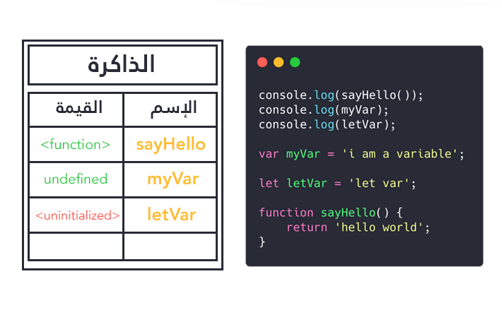

هل سبق لك أن تساءلت عن سبب قدرتنا على استدعاء دالة جافا سكريبت في مكان أعلى من الموضع الذي تم فيه التصريح بها ؟ وهل لاحظت عدم إمكانية فعل ذلك مع الأنواع الأخرى من المتغيرات ؟

الأكيد أنك عند البحث عن سبب كل ذلك واجهتك كلمة **Hoisting** وقرأتها في أماكن عديدة.

ما هو Hoisting إذن ؟ وما علاقته بهذا النوع من سلوكيات لغة البرمجة جافا سكريبت ؟

هذا ما سنعرفه ونتعلمه معا في هذا الدرس.

## ماذا يجري في الكواليس ؟

لنبدأ بهذا الكود:

```js
console.log(sayHello()); // Hello world
console.log(myVar); // undefined

var myVar = 'i am a variable';

function sayHello() {
  return 'hello world';
}
```

عند تنفيذ ما سبق سنلاحظ بأن الدالة `sayHello()` تم تنفيذها بدون مشاكل حتى قبل أن يتم التصريح بها في الكود! بينما لم نستطيع الحصول على قيمة المتغير `myVar` قبل إنشائه، وبدلا عن ذلك حصلنا على القيمة `undefined`.

**فماذا سبب ذلك يا ترى ؟**

## إعداد الذاكرة

**قبل تنفيذ أي كود** يقوم محرك الجافا سكريبت في المتصفح **بإعداد الذاكرة أولا**، وهنا تحدث الإختلافات التي تؤدي لمثل تلك الآثار الجانبية التي رأيناها أعلاه.

طريقة التعامل مع الدوال في الذاكرة خاصة ومختلفة عن طريقة التعامل مع المتغيرات، فهي تخزن على شكل مرجع (reference) يؤشر على **كامل محتوى الدالة**. وبالتالي بمجرد أن تدخل تلك الدالة في حسبان الذاكرة فإنه يمكننا استدعاؤها في أي مكان في الكود **داخل النطاق الذي تم فيه التصريح بها** (Execution context) وفي الحالة أعلاه هو **window** بالنسبة للمتصفح و **global** بالنسبة لبيئة Node.js.

> الكلام الذي قلناه الآن **صحيح فقط** بالنسبة للدوال المصرح بها بطريقة function declaration وليس الدوال التي تم إنشاؤها بطريقة function expression. هذه الأخيرة تتبع نفس سلوك المتغيرات الذي سنشرحه الآن.

فيما يخص المتغيرات فالذاكرة تسلك **منهجا مختلفا** تجاهها. فبالنسبة للمتغيرات التي انشاؤها بواسطة `var` فإنها يتم تخزينها في الذاكرة في البداية بإعطائها القيمة `undefined` ولذلك حصلنا على القيمة في المثال السابق عندما حاولنا عرض المتغير `myVar` قبل إنشائه.

## كلمة Hoisting

ترجمة كلمة Hoisting للإنجليزية تعني **الرفع**، وفي جافا سكريبت يمكننا تعريفها الآن بأنها **الآلية التي يتبعها محرك جافا سكريبت لرفع المتغيرات والدوال إلى أعلى نطاق التنفيذ الخاص بها (Execution context) في الذاكرة**.

الدالة يتم رفعها (**Hoisted**) لأعلى **نطاق التنفيذ** على شكل مرجع يؤشر على كامل الدالة وبالتالي يمكن استدعاؤها وتنفيذها **سواء أعلى مكان التصريح بها أو تحته**، بينما المتغيرات المنشأه بواسطة `var` يتم رفعها وإعطائها القيمة `undefined` افتراضيا.


## const و let لها خصوصياتها كذلك

من المزايا الجديدة التي جاءت مع إصدار جافا سكريبت ES6 نجد إمكانية إنشاء المتغيرات باستخدام الكلمتين المفتاحيتين `const` و `let` وليس فقط `var` كما كان عليه الحال دائما في إصدارات جافا سكريبت القديمة.

`const` و `let` لهما سلوك مختلف عن `var` في موضوع Hoisting.

متغيرات `var` كما قلنا يتم إعطاؤها `undefined` كقيمة افتراضية في الذاكرة، بينما متغيرات `const` و `let` يتم التأشير عليها على أنها **غير مهيأة** أو uninitialized، وإذا حاولنا الوصول إليها أعلى مكان التصريح بها فإن جافا سكريبت **سيظهر رسالة خطأ** `ReferenceError` يتوقف بموجبها البرنامج عن التنفيذ.

```js
console.log(sayHello()); // "hello world"
console.log(myVar); // undefined
console.log(letVar); // ReferenceError: Cannot access 'letVar' before initialization

var myVar = 'i am a variable';

let letVar = 'let var';

function sayHello() {
  return 'hello world';
}
```

المنطقة قبل مكان التصريح بمتغيرات `const` و `let` في نطاق التنفيذ الخاص بها تسمى **Temporel dead zone**، حيث لا يمكنك استعمال أي من تلك المتغيرات.

نفس هذا الكلام **صحيح بالنسبة للكلاسات** (Classes) المدعومة كذلك منذ إصدار جافا سكريبت ES6.



<Author slug="aissa" />
